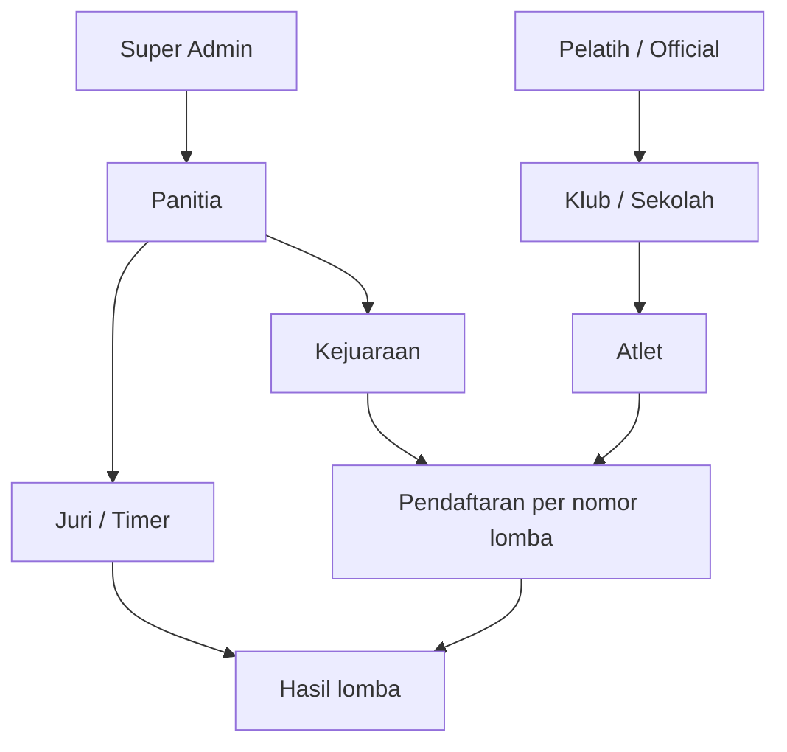
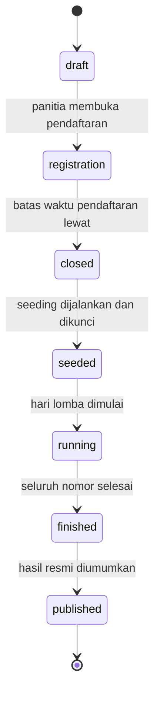

# 01 - Gambaran Umum

## Masalah yang Diselesaikan

Penyelenggaraan kejuaraan renang tingkat klub dan pelajar umumnya masih dikelola dengan berkas Excel yang dikirim bolak-balik lewat pesan instan. Masalah yang berulang:

- Data peserta dari banyak klub datang dengan format berbeda dan harus disatukan manual.
- Pembagian peserta ke seri dan lintasan dihitung tangan, rawan salah dan memakan waktu berjam-jam.
- Catatan waktu peserta sering tidak diisi, sehingga peserta cepat dan lambat tercampur dalam satu seri.
- Hasil lomba dicatat di kertas lalu diketik ulang, sehingga pengumuman juara tertunda.
- Tidak ada arsip yang bisa dilihat publik setelah acara selesai.

Sistem ini memindahkan seluruh siklus tersebut ke satu aplikasi web.

## Ruang Lingkup

Termasuk dalam sistem:

- Publikasi informasi kejuaraan, jadwal, dan biaya.
- Pendaftaran peserta oleh pelatih atau peserta mandiri.
- Import massal data peserta dari berkas Excel oleh panitia.
- Verifikasi data peserta dan pembayaran.
- Pembagian seri dan penempatan lintasan secara otomatis.
- Cetak buku acara (start list) dan lembar hasil.
- Input catatan waktu hasil lomba oleh juri.
- Perhitungan peringkat, rekap medali, dan klasemen klub.
- Arsip riwayat kejuaraan yang dapat diakses publik.

Di luar sistem pada tahap ini:

- Integrasi perangkat pencatat waktu otomatis (touchpad / timing system).
- Pembayaran daring otomatis lewat payment gateway. Pembayaran ditangani dengan unggah bukti transfer dan verifikasi manual.
- Penjurian video atau protes elektronik.

## Peran Pengguna

| Peran | Siapa | Cara masuk |
| --- | --- | --- |
| Super Admin | Pemilik sistem | Akun dibuat lewat seeder |
| Panitia | Penyelenggara kejuaraan | Diundang oleh Super Admin |
| Pelatih / Official | Perwakilan klub atau sekolah | Daftar mandiri, diverifikasi panitia |
| Juri / Timer | Petugas pencatat waktu di kolam | Dibuat panitia per kejuaraan |
| Peserta / Atlet | Perenang | Didaftarkan pelatih, atau daftar mandiri |
| Publik | Siapa saja | Tanpa akun |

Peran disimpan pada kolom `role` di tabel `users`. Bila kebutuhan izin berkembang (misalnya juri hanya boleh mengisi nomor lomba tertentu), peran dipindahkan ke `spatie/laravel-permission` tanpa mengubah alur.

### Hubungan antar peran

## Matriks Hak Akses

Keterangan: `V` berarti diizinkan, `-` berarti tidak, `O` berarti hanya untuk data miliknya sendiri.

| Kemampuan | Super Admin | Panitia | Pelatih | Juri | Peserta | Publik |
| --- | --- | --- | --- | --- | --- | --- |
| Kelola pengguna dan peran | V | - | - | - | - | - |
| Buat dan ubah kejuaraan | V | V | - | - | - | - |
| Kelola kelompok umur dan nomor lomba | V | V | - | - | - | - |
| Kelola data klub | V | V | O | - | - | - |
| Kelola data atlet | V | V | O | - | O | - |
| Daftarkan atlet ke nomor lomba | V | V | O | - | O | - |
| Import peserta dari Excel | V | V | - | - | - | - |
| Verifikasi pendaftaran | V | V | - | - | - | - |
| Verifikasi pembayaran | V | V | - | - | - | - |
| Jalankan seeding seri dan lintasan | V | V | - | - | - | - |
| Ubah lintasan secara manual | V | V | - | - | - | - |
| Cetak buku acara | V | V | O | V | O | - |
| Input catatan waktu hasil | V | V | - | V | - | - |
| Publikasikan hasil | V | V | - | - | - | - |
| Lihat start list dan hasil | V | V | V | V | V | V |
| Unduh sertifikat | V | V | O | - | O | - |

Catatan penting pada baris "Input catatan waktu hasil": pelatih tidak berhak mengisi hasil, karena akan menimbulkan konflik kepentingan. Pelatih hanya mengisi *seed time* saat pendaftaran, yang perbedaannya dijelaskan di [Catatan Waktu](06-catatan-waktu.md).

## Status Kejuaraan

Sebagian besar hak akses di atas dibatasi lagi oleh status kejuaraan. Satu kejuaraan bergerak melalui rangkaian status berikut dan tidak bisa mundur kecuali oleh Super Admin.

| Status | Yang bisa dilakukan |
| --- | --- |
| `draft` | Panitia menyusun nomor lomba. Belum terlihat publik. |
| `registration` | Pendaftaran dan import Excel terbuka. Seed time masih bisa diubah. |
| `closed` | Pendaftaran ditutup. Panitia merapikan data dan pembayaran. |
| `seeded` | Seri dan lintasan sudah dikunci. Buku acara bisa dicetak. |
| `running` | Juri mengisi catatan waktu. |
| `finished` | Seluruh hasil masuk, menunggu verifikasi akhir. |
| `published` | Hasil resmi dan sertifikat terbuka untuk publik. |

## Prinsip Perancangan

- **Data waktu disimpan sebagai bilangan bulat milidetik**, bukan teks. Pengurutan dan penjumlahan menjadi tepat, dan format tampilan dipisahkan dari penyimpanan.
- **Seeding bersifat reproducible.** Menjalankan ulang seeding pada data yang sama menghasilkan susunan yang sama, termasuk untuk peserta tanpa catatan waktu yang urutannya diacak dengan seed acak tetap.
- **Perubahan setelah penguncian selalu meninggalkan jejak.** Setelah status `seeded`, setiap pergeseran lintasan dan koreksi hasil tercatat beserta pelakunya.
- **Halaman publik tidak memerlukan akun.** Start list dan hasil dapat dibagikan lewat tautan langsung.
