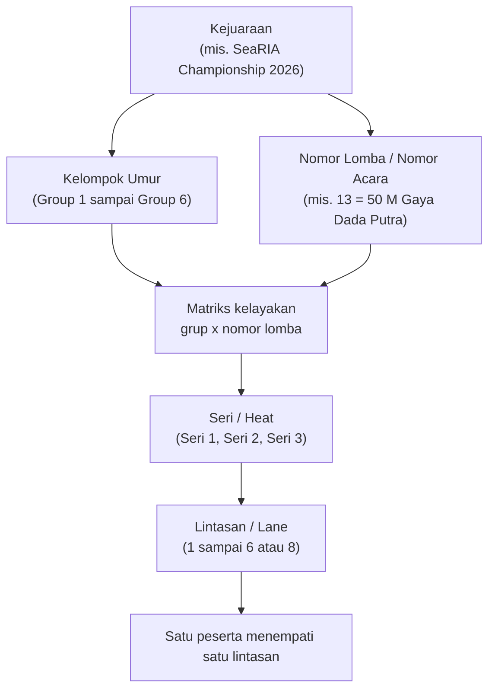

# 03 - Struktur Lomba

Dokumen ini menjelaskan bagaimana satu kejuaraan disusun: dari kejuaraan, turun ke kelompok umur dan nomor lomba, lalu ke seri dan lintasan.

## Hierarki



Poin yang mudah terlewat: **seri dibentuk per kombinasi nomor lomba dan kelompok umur**, bukan per nomor lomba saja. Satu nomor lomba yang diikuti tiga kelompok umur akan menghasilkan tiga rangkaian seri yang terpisah, dan peringkatnya pun dihitung terpisah.

## Kejuaraan

| Atribut | Contoh | Keterangan |
| --- | --- | --- |
| Nama | SeaRIA Aquatic Championship 2026 | |
| Tempat | Kolam Renang Painan, Pesisir Selatan | |
| Tanggal | 12 - 13 Oktober 2026 | Bisa lebih dari satu hari |
| Jumlah lintasan | 6 atau 8 | Menentukan berapa seri yang terbentuk |
| Panjang kolam | 25 m atau 50 m | Memengaruhi keabsahan rekor |
| Jenis | Resmi atau Fun | Kejuaraan Fun biasanya tidak dicatat sebagai rekor |
| Batas nomor per atlet | 3 | Satu atlet maksimal mendaftar sekian nomor lomba |
| Mode seeding | `balanced` | Lihat [Seri dan Lintasan](05-seri-dan-lintasan.md) |

## Kelompok Umur

Kelompok umur ditentukan dari **tahun lahir**, bukan usia pada hari lomba. Cara ini dipakai supaya penempatan tidak berubah bila tanggal lomba diundur.

Contoh konfigurasi enam grup:

| Kode | Nama | Tahun lahir | Perkiraan usia |
| --- | --- | --- | --- |
| 1 | Group 1 | 2019 dan sesudahnya | 7 tahun ke bawah |
| 2 | Group 2 | 2017 - 2018 | 8 - 9 tahun |
| 3 | Group 3 | 2015 - 2016 | 10 - 11 tahun |
| 4 | Group 4 | 2013 - 2014 | 12 - 13 tahun |
| 5 | Group 5 | 2011 - 2012 | 14 - 15 tahun |
| 6 | Group 6 | 2010 dan sebelumnya | 16 tahun ke atas |

Angka pada tabel di atas adalah contoh. Rentang tahun lahir disimpan sebagai data (`age_groups.birth_year_start` dan `birth_year_end`), sehingga panitia mengubahnya sendiri tiap tahun tanpa menyentuh kode.

Beberapa penyelenggara menampilkan kelompok umur sebagai angka Romawi pada kolom `AGE` di buku acara, misalnya `V` untuk kelompok kelima. Kolom `age_groups.display_code` menyimpan label tampilan tersebut secara terpisah dari kode internalnya.

Aturan penentuan grup:

1. Ambil `tahun_lahir` atlet.
2. Cari satu kelompok umur pada kejuaraan tersebut yang memenuhi `birth_year_start <= tahun_lahir <= birth_year_end`.
3. Bila tidak ada yang cocok, pendaftaran ditolak dengan pesan bahwa atlet berada di luar rentang usia kejuaraan.
4. Rentang antar grup tidak boleh saling tumpang tindih. Validasi ini dijalankan saat panitia menyimpan konfigurasi grup.

## Nomor Lomba

Satu nomor lomba adalah kombinasi dari empat unsur:

| Unsur | Nilai yang mungkin |
| --- | --- |
| Jarak | 25 m, 50 m (dapat ditambah 100 m dan seterusnya) |
| Gaya | Gaya Kupu-Kupu, Gaya Punggung, Gaya Dada, Gaya Bebas, Gaya Ganti |
| Alat bantu | Tanpa alat, Fins (kaki katak), Kickboard (papan luncur) |
| Gender | PA (putra), PI (putri) |

Setiap kombinasi memperoleh satu **nomor acara** yang menentukan urutan tampil di hari lomba. Konvensi yang dipakai pada brosur referensi: nomor ganjil untuk putra dan nomor genap untuk putri, dipasangkan agar satu nomor lomba muncul berdampingan.

### Susunan acara contoh

| PA | Nomor Perlombaan | PI |
| --- | --- | --- |
| 01 | 50 M Gaya Kupu-Kupu | 02 |
| 03 | 50 M Gaya Punggung | 04 |
| 05 | 50 M Gaya Kupu-Kupu (Fins) | 06 |
| 07 | 50 M Gaya Punggung (Fins) | 08 |
| 09 | 25 M Gaya Kupu-Kupu | 10 |
| 11 | 25 M Gaya Punggung | 12 |
| 13 | 50 M Gaya Dada | 14 |
| 15 | 50 M Gaya Bebas | 16 |
| 17 | 50 M Gaya Kupu-Kupu (Kickboard) | 18 |
| 19 | 50 M Gaya Dada (Kickboard) | 20 |
| 21 | 25 M Gaya Dada | 22 |
| 23 | 25 M Gaya Bebas | 24 |
| 25 | 25 M Gaya Kupu-Kupu (Kickboard) | 26 |
| 27 | 25 M Gaya Dada (Kickboard) | 28 |
| 29 | 50 M Gaya Bebas (Kickboard) | 30 |
| 31 | 25 M Gaya Bebas (Kickboard) | 32 |
| 33 | 50 M Bebas (Fins) | 34 |

Tujuh belas nomor lomba menghasilkan tiga puluh empat nomor acara. Penomoran ini disimpan pada kolom `events.event_number` dan dapat diganti sepenuhnya oleh panitia. Penyelenggara yang memakai penomoran tiga digit seperti `111` dan `112` juga terakomodasi karena kolomnya berupa bilangan bebas, bukan urutan otomatis.

## Matriks Kelayakan Grup terhadap Nomor Lomba

Tidak semua kelompok umur mengikuti semua nomor lomba. Grup usia dini biasanya hanya diberi jarak 25 m tanpa alat, sedangkan grup senior mendapat jarak 50 m serta nomor fins dan kickboard.

Hubungan ini disimpan sebagai tabel penghubung `event_age_group`, satu baris untuk setiap pasangan yang diizinkan. Pada brosur cetak, hal yang sama ditampilkan sebagai matriks bertanda `V`:

| Tahun Lahir | Kupu 25 | Kupu 50 | Punggung 25 | Punggung 50 | Dada 25 | Dada 50 | Bebas 25 | Bebas 50 | Kupu Fins 50 | Punggung Fins 50 | Bebas Fins 50 | Kupu KB 25 | Kupu KB 50 | Dada KB 25 | Dada KB 50 | Bebas KB 25 | Bebas KB 50 |
| --- | --- | --- | --- | --- | --- | --- | --- | --- | --- | --- | --- | --- | --- | --- | --- | --- | --- |
| Group 1 | | | | | | | | | | | | | | | | | |
| Group 2 | | | | | | | | | | | | | | | | | |
| Group 3 | | | | | | | | | | | | | | | | | |
| Group 4 | | | | | | | | | | | | | | | | | |
| Group 5 | | | | | | | | | | | | | | | | | |
| Group 6 | | | | | | | | | | | | | | | | | |

Sel dibiarkan kosong pada dokumen ini karena isinya adalah keputusan panitia yang berubah tiap kejuaraan, bukan aturan sistem. Panitia mengisinya lewat layar F-PAN-04 berupa kisi kotak centang dengan bentuk persis seperti tabel di atas, dan hasilnya langsung dipakai sebagai penyaring pada form pendaftaran.

Konsekuensi aturan ini pada alur pendaftaran: setelah tahun lahir atlet diisi, sistem sudah mengetahui kelompok umurnya, sehingga daftar nomor lomba yang ditawarkan hanya berisi nomor yang boleh diikuti grup tersebut. Peserta tidak pernah bisa memilih nomor yang salah.

## Sesi dan Urutan Tampil

Kejuaraan besar dibagi ke beberapa sesi, misalnya sesi pagi dan sesi sore, atau hari pertama dan hari kedua. Setiap nomor lomba memiliki `session` dan `sort_order` yang menentukan urutannya dalam buku acara.

Urutan pemanggilan di hari lomba adalah:

1. Urut sesi.
2. Dalam satu sesi, urut `sort_order` lalu `event_number`.
3. Dalam satu nomor acara, urut kelompok umur dari yang termuda.
4. Dalam satu kelompok umur, urut nomor seri dari 1 ke atas, sehingga seri terakhir yang berisi peserta tercepat tampil paling akhir.

## Contoh Susunan Lengkap

Nomor acara 13, 50 M Gaya Dada Putra, diikuti Group 3 dan Group 4 pada kolam 6 lintasan:

```
Acara 13 - 50 M Gaya Dada - Putra
├── Group 3 (15 peserta)
│   ├── Seri 1  (5 peserta, paling lambat)
│   ├── Seri 2  (5 peserta)
│   └── Seri 3  (5 peserta, paling cepat)
└── Group 4 (8 peserta)
    ├── Seri 1  (4 peserta)
    └── Seri 2  (4 peserta)
```

Juara Group 3 diambil dari waktu terbaik di antara ke-15 peserta Group 3, tanpa memandang mereka berenang di seri mana. Perhitungannya dijelaskan di [Catatan Waktu](06-catatan-waktu.md).
