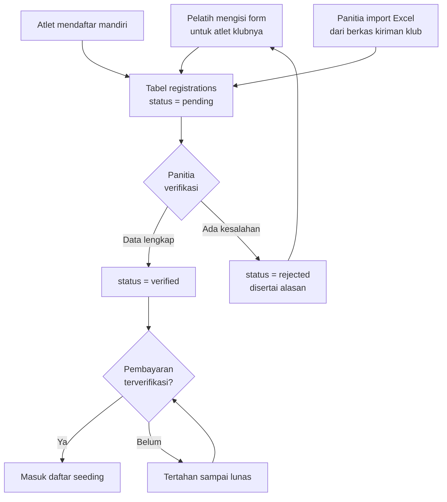
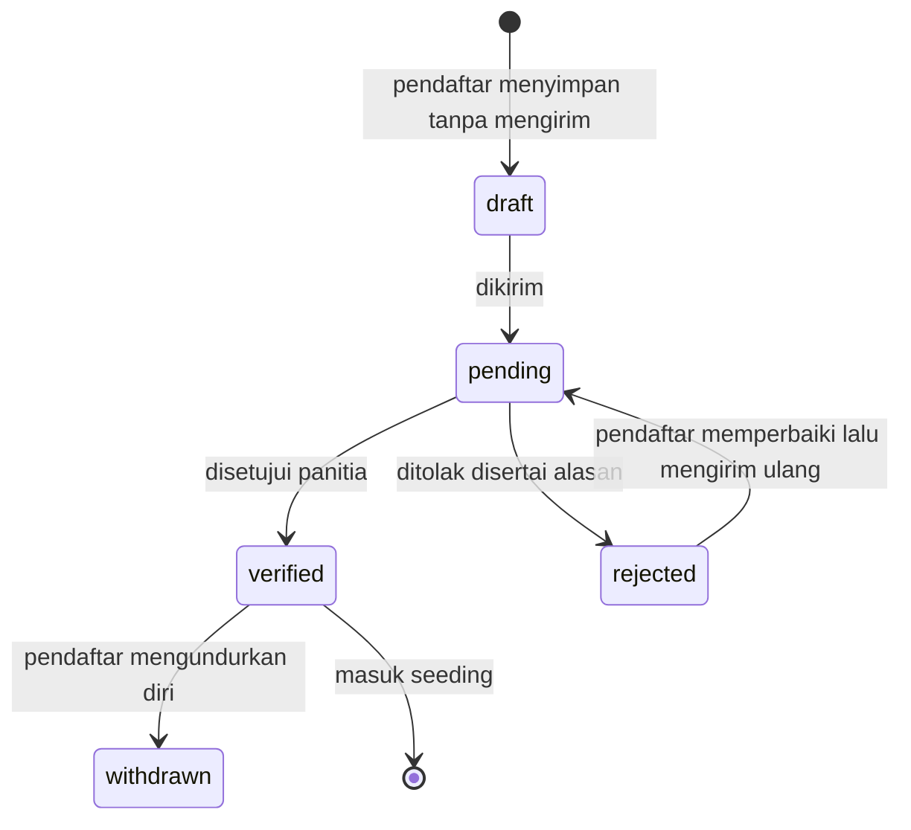
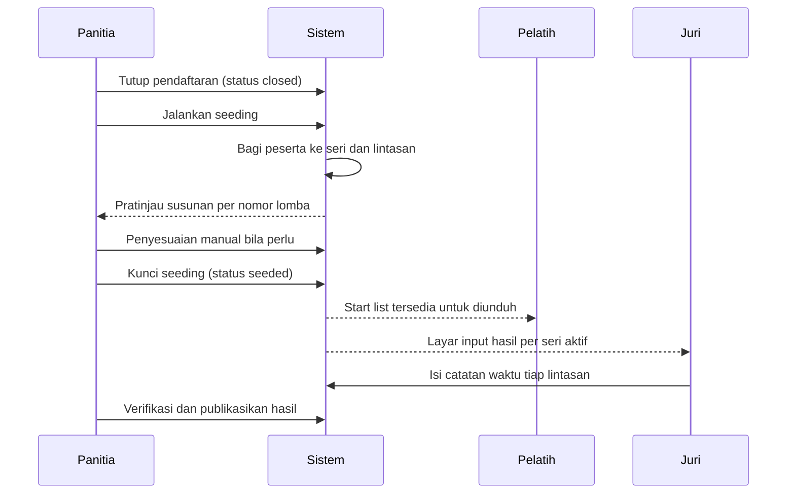

# 04 - Alur Pendaftaran

## Tiga Jalur Masuk Data Peserta

Data peserta bisa masuk ke sistem lewat tiga jalur yang bermuara pada tabel `registrations` yang sama.



Hanya pendaftaran berstatus `verified` dan sudah lunas yang ikut dalam proses seeding.

## Form Pendaftaran

Pendaftaran dilakukan per pasangan atlet dan nomor lomba. Satu kali pengisian form dapat mendaftarkan satu atlet ke beberapa nomor lomba sekaligus.

### Langkah 1 - Pilih atau tambah atlet

| Kolom | Tipe | Wajib | Validasi |
| --- | --- | --- | --- |
| Nama lengkap | teks | ya | 3 - 100 karakter, huruf dan spasi |
| Jenis kelamin | pilihan | ya | `L` atau `P` |
| Tahun lahir | angka | ya | Harus masuk salah satu rentang kelompok umur kejuaraan |
| Klub / sekolah | pilihan atau teks baru | ya | Terisi otomatis dari profil bila pendaftar adalah pelatih |
| Kabupaten / kota | teks | ya | Ikut tercetak di buku acara |
| Foto | berkas | tidak | JPG atau PNG, maksimal 2 MB |

Setelah tahun lahir diisi, sistem langsung menampilkan kelompok umur hasil pencocokan, misalnya `Tahun lahir 2016 -> Group 3`. Bila tidak ada grup yang cocok, form berhenti di sini dengan pesan bahwa atlet berada di luar rentang usia kejuaraan.

### Langkah 2 - Pilih nomor lomba dan isi catatan waktu

Daftar nomor lomba yang ditampilkan sudah disaring dua kali: pertama oleh jenis kelamin atlet, kedua oleh matriks kelayakan kelompok umurnya. Untuk setiap nomor yang dicentang, muncul satu kolom catatan waktu.

| Kolom | Tipe | Wajib | Validasi |
| --- | --- | --- | --- |
| Nomor lomba | kotak centang | ya, minimal satu | Jumlah tidak melebihi batas nomor per atlet |
| Catatan waktu | teks | tidak | Format `mm:ss.SS`, atau dikosongkan yang berarti NT |

Kolom catatan waktu di sini adalah **seed time**, yaitu waktu terbaik atlet yang pernah dicatat sebelumnya. Fungsinya hanya untuk mengurutkan peserta ke seri dan lintasan. Mengisinya dengan waktu yang tidak realistis merugikan atlet sendiri karena akan ditempatkan di seri yang tidak sepadan. Rincian format dan alasan penyimpanannya ada di [Catatan Waktu](06-catatan-waktu.md).

Tampilan ringkas langkah kedua:

```
Atlet   : AHZA DANISH RAHMAN
Lahir   : 2016  ->  Group 3
Klub    : Gunung Sport Center - Padang

[x] Acara 13  50 M Gaya Dada - Putra          Catatan waktu: [ 00:52.20 ]
[x] Acara 15  50 M Gaya Bebas - Putra         Catatan waktu: [          ]  -> NT
[ ] Acara 21  25 M Gaya Dada - Putra
[ ] Acara 23  25 M Gaya Bebas - Putra

Terpakai 2 dari 3 nomor yang diizinkan.
```

### Langkah 3 - Ringkasan dan pengiriman

Sistem menampilkan rekap seluruh entri beserta perhitungan biaya, lalu pendaftar menyetujui ketentuan dan mengirim. Seluruh entri tersimpan dalam satu transaksi basis data agar tidak ada pendaftaran yang setengah jadi.

## Aturan Validasi Pendaftaran

| Kode | Aturan | Pesan bila dilanggar |
| --- | --- | --- |
| V-01 | Status kejuaraan harus `registration` | Pendaftaran sudah ditutup |
| V-02 | Tahun lahir harus masuk salah satu kelompok umur | Usia atlet di luar rentang kejuaraan ini |
| V-03 | Kelompok umur atlet harus terdaftar pada matriks kelayakan nomor tersebut | Group 3 tidak mengikuti nomor 50 M Gaya Kupu-Kupu (Fins) |
| V-04 | Jenis kelamin atlet harus sesuai gender nomor lomba | Nomor ini khusus putri |
| V-05 | Satu atlet hanya boleh sekali pada satu nomor lomba | Atlet sudah terdaftar di nomor ini |
| V-06 | Jumlah nomor per atlet tidak melebihi batas kejuaraan | Maksimal 3 nomor per atlet |
| V-07 | Format catatan waktu harus dikenali parser | Format waktu tidak valid, contoh yang benar 00:52.20 |
| V-08 | Catatan waktu harus berada dalam rentang wajar | Waktu terlalu cepat untuk jarak 50 m |
| V-09 | Klub harus sudah terverifikasi bila pendaftar adalah pelatih | Akun klub Anda belum diverifikasi panitia |

Aturan V-08 memakai ambang bawah sederhana per jarak, misalnya 50 m tidak mungkin ditempuh di bawah 20 detik pada kejuaraan kelompok umur. Ambang ini menahan salah ketik seperti `00:05.20` yang seharusnya `00:52.00`, karena kesalahan semacam itu akan menempatkan peserta di seri tercepat dan mengacaukan susunan.

## Verifikasi oleh Panitia

Panitia melihat antrean pendaftaran berstatus `pending` dan memeriksa tiga hal: kesesuaian tahun lahir dengan dokumen pendukung, kewajaran catatan waktu, dan kelengkapan identitas klub.



Perubahan status meninggalkan catatan berisi pelaku, waktu, dan alasan. Setelah status kejuaraan berpindah ke `closed`, pendaftar tidak dapat lagi mengubah entri; koreksi hanya dilakukan panitia.

## Biaya dan Pembayaran

Biaya dihitung per entri, yaitu per pasangan atlet dan nomor lomba.

```
total = jumlah_entri_terverifikasi x biaya_per_nomor
      + (biaya_keterlambatan bila didaftarkan setelah batas normal)
```

Alur pembayarannya:

1. Panitia menutup pendaftaran atau pelatih menekan tombol kunci entri klub.
2. Sistem menerbitkan satu tagihan per klub berisi rincian seluruh entri.
3. Pelatih mentransfer dan mengunggah bukti.
4. Panitia mencocokkan nominal lalu menandai tagihan lunas.
5. Seluruh entri pada tagihan tersebut menjadi memenuhi syarat untuk seeding.

Tagihan dibuat per klub, bukan per entri, karena pada praktiknya satu klub mentransfer sekaligus untuk semua atletnya. Pendaftar perorangan diperlakukan sebagai klub berisi satu orang agar alurnya tetap sama.

Entri yang belum lunas hingga batas waktu pembayaran otomatis berubah menjadi `withdrawn` dan tidak diikutkan dalam seeding. Panitia dapat mengembalikan status ini secara manual bila ada keterlambatan yang bisa dimaklumi.

## Setelah Pendaftaran Ditutup



Proses pembagian seri dan lintasan pada langkah ketiga dijelaskan lengkap di [Seri dan Lintasan](05-seri-dan-lintasan.md).
