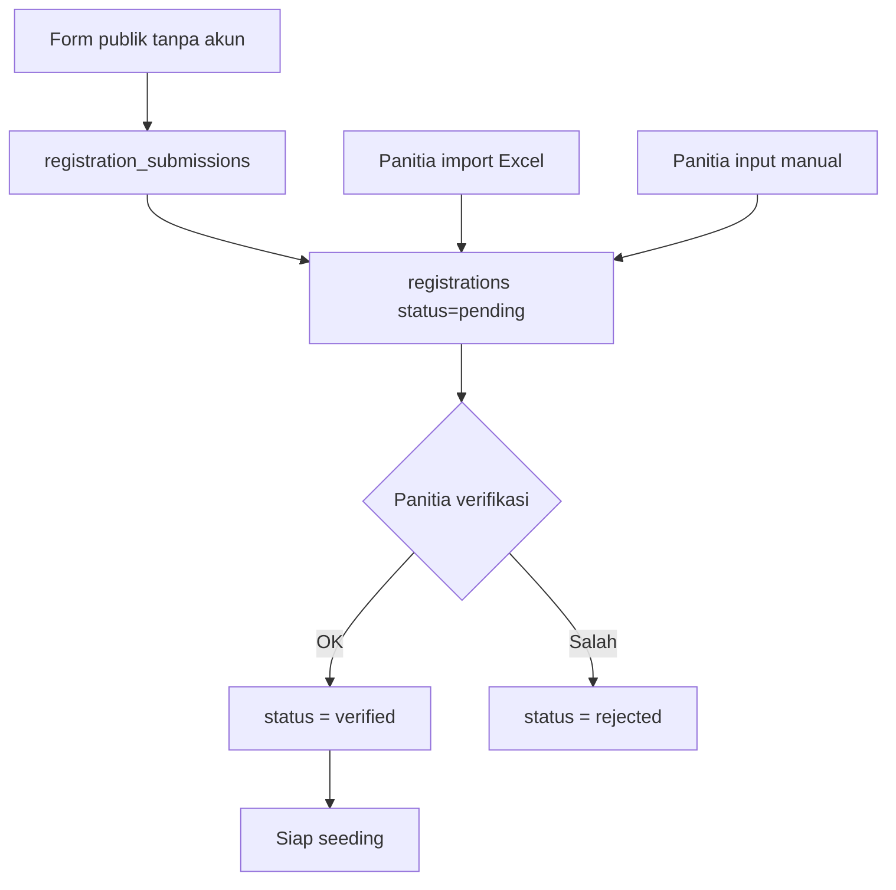

# 04 - Alur Pendaftaran (MVP, tanpa pembayaran)

## Tiga Jalur Masuk

Semua bermuara ke tabel `registrations`.

**Hanya status `verified` yang ikut seeding.** Tidak ada syarat lunas/tagihan.

## Form Publik

1. Kontak pendaftar (nama, telepon, email opsional) + data atlet (nama, gender, tahun lahir) + **klub diketik sendiri** (nama klub + kabupaten/kota).
2. Pilih nomor lomba yang layak + seed time opsional (kosong = NT).
3. Kirim → kode `REG-…`. Pendaftar tidak mengedit lagi; koreksi lewat panitia.

Klub baru dari form masuk berstatus `pending` sampai panitia verifikasi. Nama klub yang sama dipakai ulang otomatis.

Proteksi: rate limit IP, honeypot.

## Import Excel

Template + validasi baris + pratinjau + commit. Rincian di [07-import-excel.md](07-import-excel.md).

## Input Manual Panitia

Panitia menambah atau mengubah pasangan atlet × nomor lomba dari admin tanpa lewat wizard publik.

## Verifikasi

Panitia menyetujui atau menolak entri. Setelah `verified`, entri masuk antrean seeding.

## Validasi Inti

| Kode | Aturan |
| --- | --- |
| V-01 | Tahun lahir masuk salah satu kelompok umur |
| V-02 | Nomor sesuai gender atlet |
| V-03 | Nomor diizinkan matriks kelompok umur |
| V-04 | Jumlah nomor ≤ batas per atlet |
| V-05 | Tidak dobel atlet × nomor pada kejuaraan yang sama |
| V-06 | Format seed time valid atau kosong (NT) |
