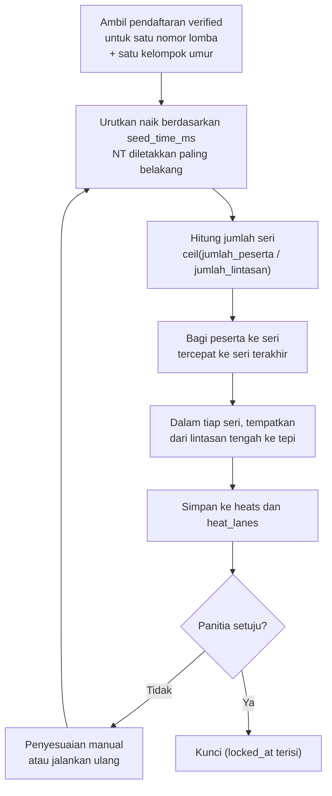

# 05 - Seri dan Lintasan

Bagian ini menjawab pertanyaan inti: setelah peserta mendaftar dan mengisi catatan waktu, bagaimana mereka dibagi ke seri dan ditempatkan ke lintasan.

## Mengapa Perlu Seri

Kolam punya jumlah lintasan terbatas, umumnya 6 atau 8. Bila peserta satu nomor lomba lebih banyak dari jumlah lintasan, mereka harus berenang bergantian dalam beberapa gelombang. Satu gelombang inilah yang disebut **seri** atau *heat*.

Dua aturan yang menentukan susunannya:

1. **Peserta dengan catatan waktu setara dikumpulkan di seri yang sama.** Perlombaan menjadi lebih ketat dan penonton melihat balapan yang seru, bukan satu orang yang jauh meninggalkan yang lain.
2. **Peserta tercepat ditempatkan di lintasan tengah.** Lintasan tengah paling sedikit terkena pantulan gelombang dari dinding kolam, sehingga menjadi posisi paling menguntungkan dan diberikan kepada yang paling berhak.

## Kapan Seeding Dijalankan

Seeding dijalankan panitia setelah pendaftaran ditutup, sebelum buku acara dicetak. Prosesnya berjalan per kombinasi nomor lomba dan kelompok umur, dan dapat diulang berkali-kali selama hasilnya belum dikunci.

Yang diikutkan dalam seeding hanyalah pendaftaran berstatus `verified` yang tagihannya sudah lunas.

## Algoritma



### Langkah 1 - Urutkan peserta

Peserta diurutkan naik berdasarkan `seed_time_ms`, sehingga yang tercepat berada di urutan pertama.

Peserta tanpa catatan waktu (`seed_time_ms` bernilai `NULL`, ditampilkan sebagai NT atau `99:99:99`) selalu diletakkan setelah seluruh peserta yang punya waktu. Di antara sesama peserta NT, urutannya diacak, bukan mengikuti urutan pendaftaran. Alasannya, urutan pendaftaran memberi keuntungan tidak adil kepada klub yang mendaftar paling awal.

Pengacakan memakai bilangan acak dengan benih tetap, yaitu `hash(competition_id, event_id, age_group_id)`. Konsekuensinya, menjalankan ulang seeding pada data yang sama selalu menghasilkan susunan yang sama, sehingga panitia tidak akan menemukan buku acara berubah sendiri setelah dicetak ulang.

Bila dua peserta punya seed time persis sama, urutannya ditentukan berturut-turut oleh nama klub lalu nama atlet secara alfabetis. Aturan ini membuat hasilnya tetap sama pada setiap kali eksekusi.

### Langkah 2 - Hitung jumlah seri

```
jumlah_seri = ceil(jumlah_peserta / jumlah_lintasan)
```

`jumlah_lintasan` diambil dari konfigurasi kolam pada kejuaraan (`competitions.pool_lanes`).

| Peserta | Lintasan | Jumlah seri |
| --- | --- | --- |
| 5 | 6 | 1 |
| 15 | 6 | 3 |
| 15 | 8 | 2 |
| 20 | 6 | 4 |
| 33 | 8 | 5 |

### Langkah 3 - Bagi peserta ke seri

Sistem memakai mode `balanced` sebagai bawaan, artinya jumlah peserta dibuat semerata mungkin antar seri. Seri yang tidak penuh lebih baik daripada satu seri berisi dua orang saja.

```
dasar = floor(jumlah_peserta / jumlah_seri)
sisa  = jumlah_peserta - (dasar x jumlah_seri)
```

Setiap seri mendapat `dasar` peserta, lalu `sisa` peserta tambahan dibagikan satu per satu mulai dari seri terakhir.

Pengisian dilakukan dari seri terakhir ke seri pertama, dan peserta diambil dari urutan tercepat. Hasilnya: **seri dengan nomor terbesar berisi peserta tercepat**, dan seri 1 berisi peserta terlambat termasuk yang NT.

| Peserta | Lintasan | Seri | Isi tiap seri (Seri 1 ... Seri N) |
| --- | --- | --- | --- |
| 15 | 6 | 3 | 5, 5, 5 |
| 17 | 6 | 3 | 5, 6, 6 |
| 15 | 8 | 2 | 7, 8 |
| 20 | 8 | 3 | 6, 7, 7 |

Panitia dapat memilih mode alternatif `fill_from_last` pada pengaturan kejuaraan. Mode itu mengisi seri terakhir sampai penuh lebih dulu, lalu turun ke seri sebelumnya, sehingga hanya seri 1 yang mungkin tidak penuh. Untuk 15 peserta pada kolam 6 lintasan hasilnya menjadi 3, 6, 6.

### Langkah 4 - Tempatkan ke lintasan

Dalam satu seri, peserta tercepat mendapat lintasan tengah, berikutnya lintasan di sebelahnya, dan seterusnya berselang-seling ke luar. Urutan penempatannya:

| Jumlah lintasan | Urutan pemberian lintasan |
| --- | --- |
| 4 | 2, 3, 1, 4 |
| 5 | 3, 2, 4, 1, 5 |
| 6 | 3, 4, 2, 5, 1, 6 |
| 8 | 4, 5, 3, 6, 2, 7, 1, 8 |
| 10 | 5, 6, 4, 7, 3, 8, 2, 9, 1, 10 |

Bila jumlah peserta dalam seri lebih sedikit dari jumlah lintasan, urutan di atas dipotong sesuai kebutuhan dan lintasan sisanya dibiarkan kosong. Untuk 5 peserta di kolam 6 lintasan, lintasan yang terpakai adalah 3, 4, 2, 5, 1 dan lintasan 6 kosong.

### Langkah 5 - Simpan dan kunci

Susunan tersimpan di tabel `heats` dan `heat_lanes`. Panitia meninjau pratinjaunya, melakukan penyesuaian manual bila perlu, lalu menekan kunci. Kolom `heats.locked_at` terisi dan susunan tidak berubah lagi kecuali lewat aksi manual yang tercatat.

## Contoh Terhitung

Nomor acara 13, 50 M Gaya Dada Putra, Group 1, 15 peserta, kolam 6 lintasan.

### Hasil pengurutan

| Urutan | Nama | Klub | Seed time |
| --- | --- | --- | --- |
| 1 | Nikcholas Bryan S. | Bunda Swimming Club | 00:38.12 |
| 2 | Muhammad Ihsan A. | Swimming Sport Club | 00:39.05 |
| 3 | Lashira Anaesika | Painan Aquatic Club | 00:40.44 |
| 4 | Hazical Thaif Haris | SeaRIA Aquatic Padang | 00:41.20 |
| 5 | Heri Rafael Panggabean | SeaRIA Aquatic Padang | 00:42.83 |
| 6 | Muhammad Habibi Akbar | Homi Swimming Club | 00:43.11 |
| 7 | Naufal Sidqi Lumbantobing | Padang Swimming Club | 00:44.60 |
| 8 | Hayden Angelo Ghifari | Angkasa Swimming Club | 00:45.05 |
| 9 | Fathan Athaya A. | Swimming Sport Club | 00:46.77 |
| 10 | Dhias Riawan | Rani Swimming Club | 00:48.30 |
| 11 | Arziwarna Rafiandra A. | Painan Jaya Swimming Club | 00:49.15 |
| 12 | Bintang Al Rafaeyza | SeaRIA Aquatic Padang | 00:51.02 |
| 13 | Elyathan Halim | Rio Aquatic | NT |
| 14 | Hansel Ali Ghufron | Alinafiqa Akuatik Padang | NT |
| 15 | Abdullah Hanif R. | Get Fit Swimming | NT |

Tiga peserta terakhir tidak mengisi catatan waktu. Urutan di antara mereka bertiga adalah hasil pengacakan bertenih tetap, bukan urutan pendaftaran.

### Pembagian ke seri

15 peserta dibagi 6 lintasan menghasilkan `ceil(15 / 6) = 3` seri. Dengan `dasar = 5` dan `sisa = 0`, ketiga seri masing-masing berisi 5 peserta. Pengisian dari seri terakhir mengambil urutan 1 sampai 5 untuk Seri 3, urutan 6 sampai 10 untuk Seri 2, dan urutan 11 sampai 15 untuk Seri 1.

### Susunan akhir

Urutan lintasan untuk 5 peserta di kolam 6 lintasan adalah 3, 4, 2, 5, 1.

**Seri 1** (peserta terlambat, tampil pertama)

| Lintasan | Nama | Klub | Kabupaten/Kota | Catatan Waktu |
| --- | --- | --- | --- | --- |
| 1 | Abdullah Hanif R. | Get Fit Swimming | Rokan Hulu | NT |
| 2 | Elyathan Halim | Rio Aquatic | Pekanbaru | NT |
| 3 | Arziwarna Rafiandra A. | Painan Jaya Swimming Club | Pariaman | 00:49.15 |
| 4 | Bintang Al Rafaeyza | SeaRIA Aquatic Padang | Padang | 00:51.02 |
| 5 | Hansel Ali Ghufron | Alinafiqa Akuatik Padang | Padang | NT |
| 6 | *kosong* | | | |

**Seri 2**

| Lintasan | Nama | Klub | Kabupaten/Kota | Catatan Waktu |
| --- | --- | --- | --- | --- |
| 1 | Dhias Riawan | Rani Swimming Club | Padang | 00:48.30 |
| 2 | Hayden Angelo Ghifari | Angkasa Swimming Club | Labuhan Batu | 00:45.05 |
| 3 | Muhammad Habibi Akbar | Homi Swimming Club | Bukittinggi | 00:43.11 |
| 4 | Naufal Sidqi Lumbantobing | Padang Swimming Club | Padang Sidempuan | 00:44.60 |
| 5 | Fathan Athaya A. | Swimming Sport Club | Padang | 00:46.77 |
| 6 | *kosong* | | | |

**Seri 3** (peserta tercepat, tampil terakhir)

| Lintasan | Nama | Klub | Kabupaten/Kota | Catatan Waktu |
| --- | --- | --- | --- | --- |
| 1 | Heri Rafael Panggabean | SeaRIA Aquatic Padang | Padang | 00:42.83 |
| 2 | Lashira Anaesika | Painan Aquatic Club | Pariaman | 00:40.44 |
| 3 | Nikcholas Bryan S. | Bunda Swimming Club | Padang Sidempuan | 00:38.12 |
| 4 | Muhammad Ihsan A. | Swimming Sport Club | Sawahlunto | 00:39.05 |
| 5 | Hazical Thaif Haris | SeaRIA Aquatic Padang | Padang | 00:41.20 |
| 6 | *kosong* | | | |

Perhatikan pola pada Seri 3: waktu tercepat 00:38.12 ada di lintasan 3 yaitu lintasan tengah, tercepat kedua di lintasan 4, lalu 2, 5, dan 1. Bentuk susunannya menyerupai anak panah yang mengarah ke tengah.

Nama, klub, dan kota pada contoh ini diambil dari brosur acara sebagai ilustrasi format, bukan data sungguhan.

## Penyesuaian Manual

Ada situasi yang tidak bisa diselesaikan algoritma dan memerlukan campur tangan panitia:

| Situasi | Tindakan |
| --- | --- |
| Peserta mengundurkan diri sebelum lomba | Tandai `withdrawn`. Lintasan dibiarkan kosong, peserta lain tidak digeser |
| Dua atlet satu klub kebetulan berada di lintasan bersebelahan dan panitia ingin memisahkan | Tukar lintasan antar dua peserta dalam seri yang sama |
| Seed time salah input dan baru diketahui setelah dikunci | Perbaiki nilainya lalu jalankan seeding ulang untuk nomor tersebut saja |
| Peserta datang terlambat, sudah dicoret, lalu diizinkan ikut | Masukkan ke lintasan kosong pada seri mana pun |

Semua tindakan di atas dicatat sebagai entri audit berisi pelaku, waktu, nilai sebelum, dan nilai sesudah. Menjalankan seeding ulang pada nomor yang sudah dikunci akan meminta konfirmasi eksplisit karena buku acara mungkin sudah tercetak.

## Yang Sengaja Tidak Dilakukan

- **Tidak ada babak final terpisah.** Format yang dipakai adalah *timed finals*: setiap peserta hanya berenang satu kali, dan juara ditentukan dari catatan waktu seluruh seri. Bila kelak dibutuhkan babak penyisihan dan final, tabel `heats` sudah menyediakan kolom `round` yang saat ini selalu berisi `final`.
- **Tidak ada pemerataan klub antar seri.** Beberapa penyelenggara menyebar atlet satu klub ke seri berbeda. Aturan itu tidak dipakai karena bertentangan dengan prinsip mengelompokkan peserta berdasarkan kecepatan.
- **Tidak ada penggabungan gender.** Nomor putra dan putri selalu diseeding terpisah karena keduanya adalah nomor acara yang berbeda.

## Acuan Uji

Kasus uji minimum yang harus dicakup unit test kelas seeding:

| Kasus | Masukan | Harapan |
| --- | --- | --- |
| Peserta pas satu seri | 6 peserta, 6 lintasan | 1 seri, lintasan 3-4-2-5-1-6 |
| Seri tidak penuh | 15 peserta, 6 lintasan | 3 seri berisi 5, 5, 5; lintasan 6 kosong di semuanya |
| Sisa pembagian | 17 peserta, 6 lintasan | 3 seri berisi 5, 6, 6 |
| Kolam 8 lintasan | 15 peserta, 8 lintasan | 2 seri berisi 7 dan 8 |
| Semua NT | 10 peserta tanpa waktu, 6 lintasan | 2 seri, urutan sama pada tiap eksekusi ulang |
| Campuran NT | 8 peserta berwaktu, 4 NT, 6 lintasan | Seluruh NT berada di seri 1 |
| Seed time seri | 2 peserta dengan waktu identik | Urutan mengikuti nama klub lalu nama atlet |
| Peserta tunggal | 1 peserta, 6 lintasan | 1 seri, peserta di lintasan 3 |
| Idempoten | Jalankan seeding dua kali | Susunan identik |
