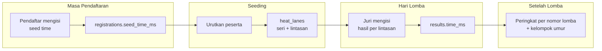
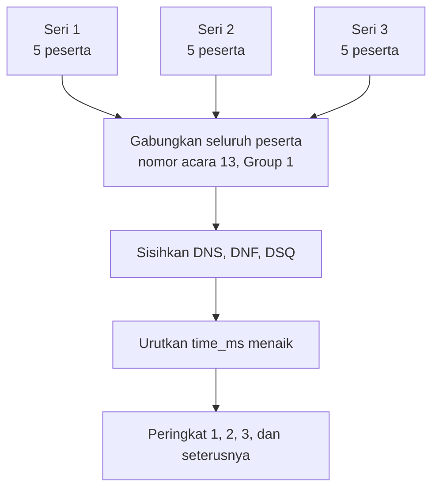

# 06 - Catatan Waktu

## Dua Catatan Waktu yang Berbeda

Istilah "catatan waktu" dipakai untuk dua hal yang sangat berbeda dalam satu kejuaraan. Mencampurnya adalah sumber kesalahan yang paling sering terjadi, sehingga keduanya disimpan pada kolom terpisah dan tidak pernah saling menimpa.

| | Seed time | Hasil lomba |
| --- | --- | --- |
| Nama kolom | `registrations.seed_time_ms` | `results.time_ms` |
| Diisi oleh | Pendaftar saat mengisi form | Juri saat lomba berlangsung |
| Kapan | Masa pendaftaran | Hari lomba |
| Asalnya | Waktu terbaik atlet pada lomba sebelumnya atau catatan latihan | Diukur di kolam |
| Fungsi | Mengurutkan peserta ke seri dan lintasan | Menentukan peringkat dan juara |
| Boleh kosong | Ya, berarti NT | Tidak, kecuali statusnya DNS, DNF, atau DSQ |
| Bisa diubah | Oleh panitia selama pendaftaran masih terbuka | Hanya oleh panitia lewat koreksi bercatat audit |



Seed time berhenti berpengaruh begitu susunan lintasan dikunci. Setelah itu, seed time hanya ditampilkan sebagai pembanding untuk melihat apakah atlet mencatat waktu yang lebih baik dari sebelumnya.

## Penyimpanan

Waktu disimpan sebagai **bilangan bulat milidetik**, bukan teks maupun tipe waktu.

```php
// 00:52.20 disimpan sebagai
52_200
```

Alasan pilihan ini:

- Pengurutan `ORDER BY seed_time_ms ASC` langsung benar. Bila disimpan sebagai teks, `"1:05.00"` akan diurutkan sebelum `"58.00"` karena perbandingannya karakter per karakter.
- Selisih waktu dan rata-rata dihitung dengan aritmetika biasa, tanpa penguraian teks.
- Tipe waktu basis data membawa konsep tanggal dan zona waktu yang tidak relevan di sini.
- Milidetik cukup untuk seluruh kebutuhan renang, yang presisi resminya hanya seperseratus detik.

Nilai `NULL` berarti tidak ada catatan waktu. Nilai ini tidak sama dengan nol, dan tidak boleh diganti angka besar seperti `999999` di basis data. Sentinel `99:99:99` hanya dipakai di lapisan tampilan agar buku acara cetak tetap serupa dengan format yang sudah dikenal panitia.

## Format Tampilan

| Kondisi | Format | Contoh |
| --- | --- | --- |
| Kurang dari 1 jam | `mm:ss.SS` | `00:52.20`, `01:34.70` |
| 1 jam atau lebih | `hh:mm:ss.SS` | `01:02:15.44` |
| Tidak ada waktu | `NT` pada layar, `99:99:99` pada cetakan | |

Pemilihan antara `NT` dan `99:99:99` diatur lewat konfigurasi `display.no_time_format`. Sentinel `99:99:99` dipertahankan sebagai opsi karena banyak buku acara terdahulu memakainya, sehingga panitia yang terbiasa tidak perlu menyesuaikan diri.

## Penguraian Masukan

Parser menerima beberapa bentuk agar pengisi data tidak perlu menghafal satu format kaku. Semuanya dinormalkan menjadi milidetik.

| Masukan | Arti | Hasil (ms) |
| --- | --- | --- |
| `52.20` | 52,20 detik | 52200 |
| `52,20` | koma diperlakukan sebagai pemisah desimal | 52200 |
| `00:52.20` | menit dan detik | 52200 |
| `1:34.70` | 1 menit 34,70 detik | 94700 |
| `01:34.70` | sama seperti di atas | 94700 |
| `00:01:34.70` | jam, menit, detik | 94700 |
| `5220` | empat digit tanpa pemisah, dibaca `mm:ss` terbalik menjadi `ss.SS` | 52200 |
| `13470` | lima digit, dibaca `m:ss.SS` | 94700 |
| `NT`, `nt`, kosong, `-`, `99:99:99` | tidak ada waktu | `NULL` |

Bentuk tanpa pemisah pada dua baris terakhir tabel angka disediakan khusus untuk layar input juri, tempat kecepatan mengetik lebih penting daripada kejelasan. Panitia dapat menonaktifkannya lewat konfigurasi bila dianggap rawan salah.

Antarmuka selalu menampilkan hasil penguraian kembali dalam format baku di sebelah kolom masukan, sehingga pengisi langsung melihat bila ketikannya salah tafsir.

### Batas kewajaran

Setelah diurai, nilai diperiksa terhadap ambang per jarak untuk menahan salah ketik.

| Jarak | Batas bawah | Batas atas |
| --- | --- | --- |
| 25 m | 10 detik | 5 menit |
| 50 m | 20 detik | 8 menit |
| 100 m | 45 detik | 15 menit |

Nilai di luar rentang ditolak pada pendaftaran, dan pada input hasil hanya memunculkan peringatan yang bisa dilewati juri, karena kejadian luar biasa di kolam memang mungkin terjadi.

## Status Selain Waktu

Tidak semua peserta menghasilkan angka. Kolom `results.status` menampung keadaan berikut.

| Status | Kepanjangan | Arti | Kolom waktu |
| --- | --- | --- | --- |
| `ok` | - | Menyelesaikan lomba secara sah | Terisi |
| `dns` | Did Not Start | Tidak hadir di balok start | `NULL` |
| `dnf` | Did Not Finish | Start tetapi tidak sampai finis | `NULL` |
| `dsq` | Disqualified | Didiskualifikasi karena pelanggaran teknik | `NULL` |

Diskualifikasi wajib disertai kode alasan agar bisa dijelaskan kepada pendaftar dan pelatih di lapangan:

| Kode | Alasan |
| --- | --- |
| `SF` | Start mendahului aba-aba |
| `ST` | Gerakan kaki atau tangan tidak sesuai gaya |
| `TN` | Pembalikan tidak sah |
| `FN` | Sentuhan finis tidak sah |
| `NA` | Tidak mencapai dinding pada pembalikan |
| `OT` | Lainnya, dijelaskan pada kolom keterangan |

Peserta berstatus selain `ok` tetap muncul di daftar hasil, ditempatkan setelah seluruh peserta yang mencatat waktu, dan tidak memperoleh peringkat.

## Perhitungan Peringkat

Aturan yang paling sering disalahpahami: **juara bukan pemenang tiap seri**. Seri hanyalah pembagian teknis karena lintasan terbatas. Peringkat dihitung dengan menggabungkan seluruh peserta dari semua seri dalam satu nomor lomba dan satu kelompok umur, lalu mengurutkan catatan waktunya.

Format ini disebut *timed finals*.



Konsekuensi yang nyata di lapangan: seorang peserta bisa menjadi juara pertama meskipun hanya finis kedua di serinya, bila waktunya lebih baik daripada pemenang seri lain. Karena itu pengumuman juara tidak boleh dilakukan sebelum seluruh seri pada nomor tersebut selesai.

### Waktu yang sama

Bila dua peserta atau lebih mencatat waktu yang persis sama, keduanya memperoleh peringkat yang sama dan peringkat berikutnya dilewati. Dua peserta di peringkat 1 membuat peserta berikutnya berada di peringkat 3, bukan 2. Medali diberikan kepada keduanya.

### Rekap medali

Peringkat 1, 2, dan 3 pada setiap kombinasi nomor lomba dan kelompok umur menghasilkan medali emas, perak, dan perunggu. Klasemen klub diurutkan berdasarkan jumlah emas terlebih dahulu, lalu perak, lalu perunggu. Jumlah total medali tidak dipakai sebagai penentu utama.

Kelompok umur yang diikuti kurang dari tiga peserta ditandai pada laporan, karena beberapa penyelenggara tidak memberikan medali penuh pada kondisi tersebut. Keputusannya diserahkan kepada panitia, sistem hanya menampilkan penanda.

## Layar Input Hasil oleh Juri

Juri membuka satu seri dan melihat baris sebanyak lintasan yang terisi. Kolom identitas sudah lengkap, sehingga yang perlu diisi hanya dua kolom paling kanan.

```
Acara 13 - 50 M Gaya Dada - Putra - Group 1 - SERI 3 dari 3

Lint  Nama                         Klub                     Seed      Hasil       Status
 1    Heri Rafael Panggabean       SeaRIA Aquatic Padang    00:42.83  [        ]  [ OK  v ]
 2    Lashira Anaesika             Painan Aquatic Club      00:40.44  [        ]  [ OK  v ]
 3    Nikcholas Bryan S.           Bunda Swimming Club      00:38.12  [        ]  [ OK  v ]
 4    Muhammad Ihsan A.            Swimming Sport Club      00:39.05  [        ]  [ OK  v ]
 5    Hazical Thaif Haris          SeaRIA Aquatic Padang    00:41.20  [        ]  [ OK  v ]
 6    -                            -                        -         -           -

                                                    [ Simpan ]  [ Kunci Seri ]
```

Perilaku layar ini:

- Setiap baris tersimpan sendiri begitu kolomnya ditinggalkan, sehingga kegagalan koneksi tidak menghapus pekerjaan.
- Mengubah status menjadi DNS, DNF, atau DSQ mengosongkan dan menonaktifkan kolom hasil.
- Tombol Kunci Seri hanya aktif setelah semua baris terisi waktu atau status.
- Setelah dikunci, juri tidak bisa lagi mengubah. Koreksi dilakukan panitia dan tercatat sebagai entri audit berisi nilai lama, nilai baru, pelaku, dan alasan.

## Perbandingan Seed Time dan Hasil

Setelah hasil dipublikasikan, halaman atlet menampilkan selisih antara hasil dan seed time.

| Selisih | Label |
| --- | --- |
| Hasil lebih cepat | Rekor pribadi baru, ditandai `PB` |
| Hasil lebih lambat | Selisih ditampilkan dengan tanda tambah |
| Seed time NT | Ditandai sebagai catatan waktu pertama |

Angka ini bernilai untuk atlet maupun untuk kejuaraan berikutnya, karena hasil resmi terakhir seorang atlet dapat diusulkan otomatis sebagai seed time saat mendaftar acara selanjutnya. Fitur pengusulan otomatis tersebut dijalankan hanya jika kejuaraan asal berjenis Resmi, bukan Fun.
