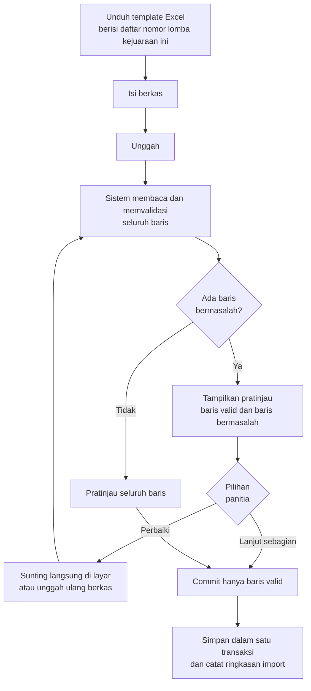

# 07 - Import Peserta dari Excel

Fitur ini melayani kebiasaan yang sudah berjalan: klub mengirimkan daftar atletnya dalam berkas Excel lewat pesan instan, dan panitia yang memasukkannya ke sistem. Daripada melawan kebiasaan tersebut, sistem menyediakan template baku dan memvalidasinya secara otomatis.

Import adalah jalur panitia. Pendaftar perorangan memakai form publik yang dijelaskan di [Alur Pendaftaran](04-alur-pendaftaran.md); keduanya bermuara pada tabel `registrations` yang sama, tetapi tagihannya terbit dengan cara berbeda.

## Alur



Titik penting pada alur ini adalah pemisahan antara **memvalidasi** dan **menyimpan**. Berkas yang diunggah tidak langsung masuk ke tabel `registrations`. Panitia selalu melihat pratinjau lebih dulu, sehingga berkas berformat kacau tidak pernah mengotori data yang sudah rapi.

## Template

Template diunduh dari layar import dan sudah menyesuaikan diri dengan kejuaraan yang sedang dibuka. Berkas berisi tiga lembar kerja.

### Lembar `PESERTA`

Satu baris mewakili satu pendaftaran, yaitu satu atlet pada satu nomor lomba. Atlet yang mengikuti tiga nomor ditulis pada tiga baris dengan identitas yang diulang.

| Kolom | Judul | Wajib | Contoh | Keterangan |
| --- | --- | --- | --- | --- |
| A | `NO` | tidak | 1 | Nomor urut, hanya untuk kenyamanan pengisi |
| B | `NAMA LENGKAP` | ya | AHZA DANISH RAHMAN | Menjadi kunci pengenal atlet bersama tahun lahir dan klub |
| C | `L/P` | ya | L | `L` untuk putra, `P` untuk putri |
| D | `TAHUN LAHIR` | ya | 2016 | Empat digit |
| E | `KLUB/SEKOLAH` | ya | Gunung Sport Center | |
| F | `KABUPATEN/KOTA` | ya | Padang | |
| G | `KODE ACARA` | ya | 13 | Nomor acara dari lembar `NOMOR LOMBA` |
| H | `CATATAN WAKTU` | tidak | 00:52.20 | Dikosongkan berarti NT |

Contoh isi:

| NO | NAMA LENGKAP | L/P | TAHUN LAHIR | KLUB/SEKOLAH | KABUPATEN/KOTA | KODE ACARA | CATATAN WAKTU |
| --- | --- | --- | --- | --- | --- | --- | --- |
| 1 | AHZA DANISH RAHMAN | L | 2016 | Gunung Sport Center | Padang | 13 | 00:52.20 |
| 2 | AHZA DANISH RAHMAN | L | 2016 | Gunung Sport Center | Padang | 15 | 00:48.15 |
| 3 | MUTYA ZAHIRA TANJUNG | P | 2017 | Angkasa Swimming Club | Labuhan Batu | 14 | |
| 4 | KAYLA GUSVADELSON | P | 2017 | Rani Boedik Swimming Club | Bukittinggi | 16 | 00:55.30 |

Kolom `KODE ACARA` sengaja memakai nomor, bukan nama gaya. Nama gaya yang diketik bebas menghasilkan puluhan variasi ejaan seperti "dada", "Gaya Dada", dan "breaststroke", yang semuanya harus ditebak sistem. Nomor acara tidak punya masalah itu.

### Lembar `NOMOR LOMBA`

Lembar rujukan yang berisi seluruh nomor acara kejuaraan tersebut beserta kelompok umur yang boleh mengikutinya. Lembar ini terkunci dan hanya untuk dibaca.

| KODE ACARA | NOMOR PERLOMBAAN | GENDER | GRUP YANG BOLEH IKUT |
| --- | --- | --- | --- |
| 13 | 50 M Gaya Dada | Putra | Group 3, Group 4, Group 5, Group 6 |
| 14 | 50 M Gaya Dada | Putri | Group 3, Group 4, Group 5, Group 6 |
| 15 | 50 M Gaya Bebas | Putra | Group 2, Group 3, Group 4, Group 5, Group 6 |

### Lembar `PETUNJUK`

Berisi penjelasan singkat tiap kolom, format catatan waktu yang diterima, rentang tahun lahir tiap kelompok umur, dan batas jumlah nomor per atlet pada kejuaraan tersebut.

## Aturan Validasi

Validasi dijalankan per baris. Satu baris bisa memiliki lebih dari satu kesalahan, dan semuanya dilaporkan sekaligus supaya pengisi tidak perlu mengunggah berulang kali untuk menemukan masalah satu per satu.

### Kesalahan yang menggagalkan baris

| Kode | Pemeriksaan | Pesan |
| --- | --- | --- |
| E-01 | Kolom wajib terisi | Kolom NAMA LENGKAP tidak boleh kosong |
| E-02 | `L/P` bernilai `L` atau `P` | Jenis kelamin harus L atau P |
| E-03 | Tahun lahir empat digit dan masuk akal | Tahun lahir tidak valid |
| E-04 | Tahun lahir masuk salah satu kelompok umur | Tahun lahir 2005 di luar rentang usia kejuaraan ini |
| E-05 | Kode acara terdaftar pada kejuaraan | Kode acara 99 tidak dikenal |
| E-06 | Gender atlet cocok dengan gender nomor acara | Kode acara 13 khusus putra, atlet ini putri |
| E-07 | Kelompok umur atlet ada pada matriks kelayakan nomor tersebut | Group 1 tidak mengikuti kode acara 13 |
| E-08 | Format catatan waktu dikenali | Format waktu `52-20` tidak dikenali |
| E-09 | Catatan waktu dalam batas kewajaran | Waktu 00:05.20 terlalu cepat untuk 50 m |
| E-10 | Tidak ada duplikat atlet dan kode acara di dalam berkas | Baris 12 mengulang baris 7 |
| E-11 | Atlet belum terdaftar di nomor tersebut lewat jalur lain | Atlet sudah terdaftar di kode acara 13 |
| E-12 | Jumlah nomor per atlet tidak melebihi batas | Atlet ini memiliki 4 baris, batasnya 3 |
| E-13 | Status kejuaraan masih `registration` | Pendaftaran sudah ditutup |

### Peringatan yang tidak menggagalkan baris

| Kode | Pemeriksaan | Perlakuan |
| --- | --- | --- |
| W-01 | Nama klub belum ada di basis data | Klub akan dibuat baru, panitia dapat memetakannya ke klub yang sudah ada |
| W-02 | Nama klub mirip dengan klub yang sudah ada | Menawarkan pencocokan, misalnya `SeaRIA Aquatic Pdg` disarankan ke `SeaRIA Aquatic Padang` |
| W-03 | Nama atlet mirip dengan atlet lain di klub yang sama dengan tahun lahir sama | Menawarkan penggabungan agar tidak ada atlet ganda |
| W-04 | Catatan waktu kosong | Akan dicatat sebagai NT |
| W-05 | Kabupaten/kota kosong | Diisi dari data klub |

Peringatan W-02 dan W-03 memakai perbandingan kemiripan teks. Ambang kemiripan dapat diatur, dan sistem tidak pernah menggabungkan secara otomatis. Penggabungan yang salah jauh lebih merepotkan daripada data ganda, karena membalikkannya berarti memisahkan riwayat dua atlet yang sudah tercampur.

## Layar Pratinjau

Setelah unggahan diproses, panitia melihat ringkasan dan tabel per baris.

```
Berkas   : peserta-bunda-swimming-club.xlsx
Dibaca   : 48 baris
Valid    : 44 baris
Bermasalah : 4 baris
Peringatan : 6 baris

Baris  Nama                    Thn   Acara  Waktu      Status
  7    AHZA DANISH RAHMAN      2016  13     00:52.20   Valid
  8    AHZA DANISH RAHMAN      2016  15     00:48.15   Valid
 12    AHZA DANISH RAHMAN      2016  13     00:52.20   E-10 duplikat dengan baris 7
 19    RANIA PUTRI             2005  14     01:02.00   E-04 tahun lahir di luar rentang
 23    BAGAS ADYATAMA          2016  05     -          E-07 Group 3 tidak ikut acara 05
 31    NAYYARA KEI SHAKOMI     2017  16     52-20      E-08 format waktu tidak dikenali

[ Unduh laporan kesalahan ]  [ Perbaiki di layar ]  [ Import 44 baris valid ]
```

Baris bermasalah dapat disunting langsung pada layar tanpa harus memperbaiki berkas asli dan mengunggah ulang. Setiap suntingan divalidasi ulang saat itu juga.

Tombol unduh laporan kesalahan menghasilkan berkas Excel berisi baris bermasalah beserta kolom tambahan yang menjelaskan penyebabnya. Berkas ini dikirim kembali kepada klub untuk diperbaiki.

## Penyimpanan

Commit dijalankan di dalam satu transaksi basis data. Bila terjadi kegagalan di tengah proses, seluruh perubahan dibatalkan sehingga tidak ada import yang tersimpan separuh.

Urutan operasinya:

1. Buat klub baru yang belum ada, atau petakan ke klub terpilih.
2. Buat atlet baru yang belum ada, atau petakan ke atlet yang sudah ada berdasarkan kombinasi nama, tahun lahir, dan klub.
3. Buat baris `registrations` dengan `status = pending` dan `import_batch_id` terisi.
4. Simpan ringkasan pada tabel `import_batches`.

Kolom `import_batch_id` memungkinkan satu import dibatalkan seluruhnya. Bila panitia menyadari berkas yang diunggah adalah versi lama, satu tombol cukup untuk menghapus seluruh pendaftaran yang berasal dari batch tersebut, selama belum ada yang diverifikasi.

## Batasan Teknis

| Aspek | Nilai |
| --- | --- |
| Format berkas | `.xlsx` dan `.csv` |
| Ukuran maksimal | 5 MB |
| Jumlah baris maksimal | 2000 per berkas |
| Pemrosesan | Antrean latar belakang bila melebihi 200 baris |
| Penyimpanan berkas asal | Disimpan pada disk `local` selama 90 hari untuk keperluan penelusuran |

Import di atas 200 baris dijalankan lewat queue Laravel supaya permintaan HTTP tidak kehabisan waktu. Panitia melihat bilah kemajuan dan menerima pemberitahuan saat validasi selesai.

## Export

Arah sebaliknya juga disediakan, memakai struktur kolom yang sama agar berkas hasil export bisa disunting lalu diunggah kembali.

| Export | Isi |
| --- | --- |
| Daftar peserta | Seluruh pendaftaran beserta statusnya |
| Start list | Nomor acara, kelompok umur, seri, lintasan, identitas, seed time |
| Lembar hasil kosong | Start list ditambah kolom kosong untuk dicatat manual di pinggir kolam |
| Hasil lomba | Seluruh catatan waktu beserta peringkat |
| Rekap medali | Perolehan medali per klub |
