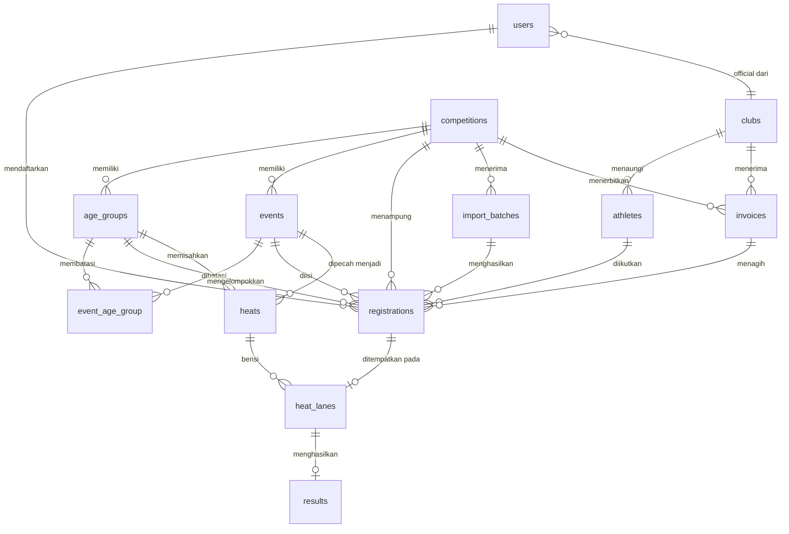
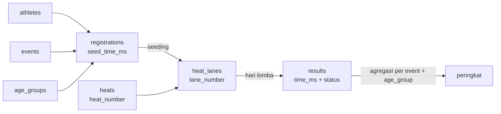

# 08 - Desain Database

Basis data yang dipakai adalah PostgreSQL. Seluruh tabel memakai kunci utama `id` bertipe `bigIncrements` dan kolom `created_at` serta `updated_at` bawaan Laravel, kecuali disebutkan lain.

## Diagram Relasi



## Peta Alur Data



## Definisi Tabel

### users

Akun untuk seluruh peran.

| Kolom | Tipe | Keterangan |
| --- | --- | --- |
| `name` | string(100) | |
| `email` | string(150) | unik |
| `password` | string | |
| `role` | enum | `super_admin`, `panitia`, `pelatih`, `juri`, `peserta` |
| `club_id` | bigint nullable | Terisi untuk pelatih dan peserta mandiri |
| `phone` | string(20) nullable | |
| `is_active` | boolean | Bawaan `true` |
| `email_verified_at` | timestamp nullable | |

Indeks: `email` unik, indeks pada `role`, indeks pada `club_id`.

### clubs

Perkumpulan renang atau sekolah.

| Kolom | Tipe | Keterangan |
| --- | --- | --- |
| `name` | string(150) | |
| `short_name` | string(30) nullable | Untuk kolom sempit di buku acara |
| `type` | enum | `perkumpulan`, `sekolah` |
| `city` | string(100) | Kabupaten atau kota, tercetak di start list |
| `province` | string(100) nullable | |
| `contact_name` | string(100) nullable | |
| `contact_phone` | string(20) nullable | |
| `logo_path` | string nullable | |
| `status` | enum | `pending`, `verified`, `rejected` |

Indeks: `name` unik, indeks pada `city`.

### athletes

| Kolom | Tipe | Keterangan |
| --- | --- | --- |
| `club_id` | bigint | |
| `full_name` | string(100) | |
| `gender` | enum | `L`, `P` |
| `birth_year` | smallint | Dasar penentuan kelompok umur |
| `birth_date` | date nullable | Untuk verifikasi dokumen |
| `identity_number` | string(30) nullable | NIK atau nomor akta |
| `photo_path` | string nullable | |
| `is_active` | boolean | |

Indeks: unik pada `club_id + full_name + birth_year` untuk menahan atlet ganda, indeks pada `birth_year`, indeks pada `gender`.

Kunci unik di atas sengaja tidak memakai nama saja, karena dua atlet bernama sama di klub berbeda adalah hal yang wajar.

### competitions

| Kolom | Tipe | Keterangan |
| --- | --- | --- |
| `slug` | string(120) | unik, untuk URL publik |
| `name` | string(150) | |
| `venue` | string(200) | |
| `city` | string(100) | |
| `start_date` | date | |
| `end_date` | date | |
| `registration_opens_at` | datetime | |
| `registration_closes_at` | datetime | |
| `technical_meeting_at` | datetime nullable | |
| `type` | enum | `resmi`, `fun` |
| `pool_lanes` | smallint | Bawaan 8. Dipakai algoritma seeding |
| `pool_length` | smallint | 25 atau 50 |
| `max_events_per_athlete` | smallint | Bawaan 3 |
| `seeding_mode` | enum | `balanced`, `fill_from_last` |
| `fee_per_event` | integer | Rupiah |
| `late_fee_per_event` | integer | Rupiah, bawaan 0 |
| `status` | enum | `draft`, `registration`, `closed`, `seeded`, `running`, `finished`, `published` |
| `banner_path` | string nullable | |
| `description` | text nullable | |

Indeks: `slug` unik, indeks pada `status`, indeks pada `start_date`.

### age_groups

| Kolom | Tipe | Keterangan |
| --- | --- | --- |
| `competition_id` | bigint | |
| `code` | string(10) | Kode internal, misalnya `1` |
| `name` | string(50) | Misalnya `Group 1` |
| `display_code` | string(10) nullable | Label cetak, misalnya angka Romawi `V` |
| `birth_year_start` | smallint | Tahun lahir paling lama |
| `birth_year_end` | smallint | Tahun lahir paling baru |
| `sort_order` | smallint | |

Indeks: unik pada `competition_id + code`.

Validasi tingkat aplikasi: rentang tahun lahir antar grup dalam satu kejuaraan tidak boleh saling tumpang tindih.

### events

Nomor lomba, atau nomor acara.

| Kolom | Tipe | Keterangan |
| --- | --- | --- |
| `competition_id` | bigint | |
| `event_number` | integer | Nomor cetak, misalnya 13 atau 111 |
| `gender` | enum | `PA`, `PI` |
| `distance` | smallint | Meter |
| `stroke` | enum | `kupu`, `punggung`, `dada`, `bebas`, `ganti` |
| `equipment` | enum | `none`, `fins`, `kickboard` |
| `session` | smallint | Sesi atau hari |
| `sort_order` | smallint | Urutan tampil dalam sesi |
| `is_active` | boolean | |

Indeks: unik pada `competition_id + event_number`, indeks pada `competition_id + session + sort_order`.

Nama nomor lomba tidak disimpan sebagai teks, melainkan disusun dari `distance`, `stroke`, `equipment`, dan `gender` saat ditampilkan. Cara ini menjaga penamaan tetap konsisten di seluruh halaman dan cetakan.

### event_age_group

Matriks kelayakan. Satu baris berarti kelompok umur tersebut boleh mengikuti nomor lomba tersebut.

| Kolom | Tipe |
| --- | --- |
| `event_id` | bigint |
| `age_group_id` | bigint |

Indeks: unik pada `event_id + age_group_id`.

### registrations

| Kolom | Tipe | Keterangan |
| --- | --- | --- |
| `competition_id` | bigint | Redundan terhadap `event_id`, disimpan untuk mempercepat kueri |
| `event_id` | bigint | |
| `athlete_id` | bigint | |
| `age_group_id` | bigint | Dibekukan saat mendaftar, tidak dihitung ulang |
| `seed_time_ms` | integer nullable | `NULL` berarti NT |
| `status` | enum | `draft`, `pending`, `verified`, `rejected`, `withdrawn` |
| `rejection_reason` | string nullable | |
| `registered_by` | bigint | `users.id` |
| `import_batch_id` | bigint nullable | |
| `invoice_id` | bigint nullable | |
| `verified_by` | bigint nullable | |
| `verified_at` | timestamp nullable | |

Indeks: unik pada `event_id + athlete_id` yang menegakkan aturan V-05, indeks pada `competition_id + status`, indeks pada `event_id + age_group_id + seed_time_ms` yang menjadi indeks utama proses seeding.

Alasan `age_group_id` dibekukan: bila panitia mengubah rentang tahun lahir di tengah masa pendaftaran, peserta yang sudah mendaftar tidak boleh berpindah grup tanpa sepengetahuan siapa pun. Perpindahan hanya terjadi lewat tindakan panitia yang tercatat.

### heats

Satu seri untuk satu kombinasi nomor lomba dan kelompok umur.

| Kolom | Tipe | Keterangan |
| --- | --- | --- |
| `event_id` | bigint | |
| `age_group_id` | bigint | |
| `heat_number` | smallint | Mulai dari 1 |
| `round` | enum | `final` saat ini. Disiapkan untuk `heat` dan `semifinal` |
| `scheduled_at` | datetime nullable | |
| `status` | enum | `pending`, `running`, `finished` |
| `locked_at` | timestamp nullable | Terisi saat panitia mengunci susunan |
| `seeded_at` | timestamp nullable | |

Indeks: unik pada `event_id + age_group_id + round + heat_number`.

### heat_lanes

Penempatan satu peserta pada satu lintasan.

| Kolom | Tipe | Keterangan |
| --- | --- | --- |
| `heat_id` | bigint | |
| `lane_number` | smallint | |
| `registration_id` | bigint | |

Indeks: unik pada `heat_id + lane_number` sehingga satu lintasan mustahil terisi dua orang, dan unik pada `registration_id` sehingga satu peserta mustahil muncul di dua lintasan.

Kedua kunci unik di atas adalah pengaman terpenting pada skema ini. Kesalahan seeding yang lolos ke buku acara jauh lebih mahal biayanya daripada kegagalan penyimpanan.

### results

| Kolom | Tipe | Keterangan |
| --- | --- | --- |
| `heat_lane_id` | bigint | unik, hubungan satu ke satu |
| `time_ms` | integer nullable | `NULL` bila status bukan `ok` |
| `status` | enum | `ok`, `dns`, `dnf`, `dsq` |
| `dsq_code` | string(5) nullable | `SF`, `ST`, `TN`, `FN`, `NA`, `OT` |
| `dsq_reason` | string nullable | |
| `recorded_by` | bigint | `users.id` juri |
| `recorded_at` | timestamp | |
| `verified_by` | bigint nullable | |
| `verified_at` | timestamp nullable | |

Indeks: `heat_lane_id` unik, indeks pada `status`.

Peringkat tidak disimpan sebagai kolom. Nilainya dihitung saat kueri karena satu koreksi waktu akan mengubah peringkat banyak peserta sekaligus, dan menyimpan hasil turunan semacam itu mudah menjadi tidak sinkron. Bila kelak halaman hasil terasa lambat, jalan keluarnya adalah materialized view yang disegarkan setelah publikasi, bukan kolom biasa.

### import_batches

| Kolom | Tipe | Keterangan |
| --- | --- | --- |
| `competition_id` | bigint | |
| `user_id` | bigint | Pengunggah |
| `original_filename` | string | |
| `stored_path` | string | |
| `total_rows` | integer | |
| `valid_rows` | integer | |
| `invalid_rows` | integer | |
| `status` | enum | `uploaded`, `validating`, `validated`, `committed`, `cancelled`, `failed` |
| `errors` | jsonb nullable | Rincian kesalahan per baris |
| `committed_at` | timestamp nullable | |

### invoices

Tagihan biaya pendaftaran, diterbitkan per klub per kejuaraan.

| Kolom | Tipe | Keterangan |
| --- | --- | --- |
| `competition_id` | bigint | |
| `club_id` | bigint | |
| `invoice_number` | string(30) | unik |
| `item_count` | integer | Jumlah entri yang ditagih |
| `amount` | integer | Rupiah |
| `proof_path` | string nullable | Bukti transfer |
| `status` | enum | `unpaid`, `waiting_verification`, `paid`, `rejected` |
| `verified_by` | bigint nullable | |
| `verified_at` | timestamp nullable | |
| `due_at` | datetime nullable | |

Indeks: unik pada `competition_id + club_id`, `invoice_number` unik.

### activity_logs

Jejak audit untuk perubahan yang berdampak pada hasil lomba.

| Kolom | Tipe | Keterangan |
| --- | --- | --- |
| `user_id` | bigint | Pelaku |
| `action` | string(50) | Misalnya `heat_lane.swap`, `result.correct`, `seeding.rerun` |
| `subject_type` | string | Kelas model |
| `subject_id` | bigint | |
| `old_values` | jsonb nullable | |
| `new_values` | jsonb nullable | |
| `reason` | string nullable | |
| `ip_address` | string(45) nullable | |

Indeks: `subject_type + subject_id`, `user_id`, `created_at`.

## Kueri Kunci

### Ambil peserta untuk seeding

```sql
SELECT r.id, r.seed_time_ms, a.full_name, c.name AS club_name
FROM registrations r
JOIN athletes a ON a.id = r.athlete_id
JOIN clubs c ON c.id = a.club_id
LEFT JOIN invoices i ON i.id = r.invoice_id
WHERE r.event_id = :event_id
  AND r.age_group_id = :age_group_id
  AND r.status = 'verified'
  AND (i.id IS NULL OR i.status = 'paid')
ORDER BY r.seed_time_ms ASC NULLS LAST, c.name ASC, a.full_name ASC;
```

Klausa `NULLS LAST` adalah bagian yang mudah terlupa. Tanpa itu, PostgreSQL menempatkan `NULL` di akhir pada pengurutan menaik secara bawaan, tetapi menuliskannya secara eksplisit membuat maksudnya jelas dan hasilnya tetap sama bila kelak arah pengurutan diubah.

### Peringkat satu nomor lomba dan kelompok umur

```sql
SELECT
    RANK() OVER (ORDER BY res.time_ms ASC) AS peringkat,
    a.full_name,
    c.name AS club_name,
    res.time_ms,
    h.heat_number,
    hl.lane_number
FROM results res
JOIN heat_lanes hl ON hl.id = res.heat_lane_id
JOIN heats h ON h.id = hl.heat_id
JOIN registrations r ON r.id = hl.registration_id
JOIN athletes a ON a.id = r.athlete_id
JOIN clubs c ON c.id = a.club_id
WHERE h.event_id = :event_id
  AND h.age_group_id = :age_group_id
  AND res.status = 'ok'
ORDER BY res.time_ms ASC;
```

Fungsi `RANK()` sudah menangani aturan waktu sama pada [Catatan Waktu](06-catatan-waktu.md): dua peserta di peringkat 1 membuat peserta berikutnya berada di peringkat 3.

## Urutan Migrasi

Migrasi dibuat mengikuti arah ketergantungan kunci asing.

```
0001  clubs
0002  users            (tambah role dan club_id pada tabel bawaan)
0003  athletes
0004  competitions
0005  age_groups
0006  events
0007  event_age_group
0008  import_batches
0009  invoices
0010  registrations
0011  heats
0012  heat_lanes
0013  results
0014  activity_logs
```

## Model Eloquent

| Model | Relasi utama |
| --- | --- |
| `Club` | `hasMany(Athlete)`, `hasMany(User)`, `hasMany(Invoice)` |
| `Athlete` | `belongsTo(Club)`, `hasMany(Registration)` |
| `Competition` | `hasMany(AgeGroup)`, `hasMany(Event)`, `hasMany(Registration)` |
| `AgeGroup` | `belongsTo(Competition)`, `belongsToMany(Event)` |
| `Event` | `belongsTo(Competition)`, `belongsToMany(AgeGroup)`, `hasMany(Heat)` |
| `Registration` | `belongsTo(Athlete)`, `belongsTo(Event)`, `belongsTo(AgeGroup)`, `hasOne(HeatLane)` |
| `Heat` | `belongsTo(Event)`, `belongsTo(AgeGroup)`, `hasMany(HeatLane)` |
| `HeatLane` | `belongsTo(Heat)`, `belongsTo(Registration)`, `hasOne(Result)` |
| `Result` | `belongsTo(HeatLane)` |

Kolom waktu dibungkus dengan cast khusus agar lapisan aplikasi tidak berurusan dengan angka milidetik mentah:

```php
protected function casts(): array
{
    return [
        'seed_time_ms' => SwimTime::class,
    ];
}
```

Kelas `SwimTime` bertanggung jawab atas penguraian masukan dan pemformatan tampilan seperti yang dijelaskan di [Catatan Waktu](06-catatan-waktu.md), sehingga aturan format hanya ditulis satu kali.
