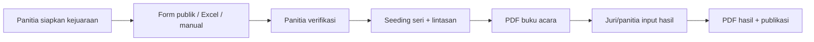

# Dokumentasi Sistem SeaRIA (MVP)

Sistem Pendaftaran dan Manajemen Kejuaraan Renang — **versi sederhana tanpa pembayaran**.

## Daftar Isi

| No | Dokumen | Isi |
| --- | --- | --- |
| 01 | [Gambaran Umum](01-gambaran-umum.md) | Tujuan, peran, hak akses |
| 02 | [Katalog Fitur](02-fitur.md) | Fitur MVP per peran |
| 03 | [Struktur Lomba](03-struktur-lomba.md) | Kelompok umur, nomor lomba, matriks |
| 04 | [Alur Pendaftaran](04-alur-pendaftaran.md) | Form publik, Excel, input manual |
| 05 | [Seri dan Lintasan](05-seri-dan-lintasan.md) | Algoritma seeding |
| 06 | [Catatan Waktu](06-catatan-waktu.md) | Seed time vs hasil |
| 07 | [Import Excel](07-import-excel.md) | Template dan validasi unggah |
| 08 | [Desain Database](08-database.md) | ERD dan tabel |
| 09 | [Glosarium](09-glosarium.md) | Istilah |
| -- | [Backlog Task](tasks/README.md) | Task MVP per modul |
| -- | [Ditunda](deferred/README.md) | Biaya, sertifikat, dll. |

## Alur MVP dalam Satu Halaman



Tiga pembeda utama:

1. **Seed time ≠ hasil lomba** — disimpan terpisah.
2. **Seeding otomatis** — sistem membagi seri dan lintasan.
3. **Peringkat lintas seri** — juara dari waktu terbaik seluruh seri per nomor × kelompok umur.

**Tidak termasuk MVP:** tagihan/pembayaran, unggah bukti transfer, sertifikat, mode offline juri, CMS publik berat.

## Lingkungan

| Komponen | Versi |
| --- | --- |
| PHP | 8.2+ |
| Laravel | 12.x |
| Frontend | Vite + Tailwind |
| Basis data | MySQL/MariaDB atau PostgreSQL |

```bash
composer setup
composer dev
composer test
```
