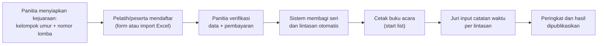

# Dokumentasi Sistem SeaRIA

Sistem Pendaftaran dan Manajemen Kejuaraan Renang.

Dokumen ini adalah spesifikasi fungsional dan teknis yang menjadi acuan pembangunan aplikasi. Saat dokumen ini ditulis, kode di repositori masih berupa kerangka Laravel 12 bawaan, sehingga seluruh isi dokumen bersifat rancangan yang akan diimplementasikan.

## Daftar Isi

| No | Dokumen | Isi |
| --- | --- | --- |
| 01 | [Gambaran Umum](01-gambaran-umum.md) | Tujuan sistem, peran pengguna, matriks hak akses |
| 02 | [Katalog Fitur](02-fitur.md) | Rincian fitur per peran pengguna |
| 03 | [Struktur Lomba](03-struktur-lomba.md) | Kejuaraan, kelompok umur, nomor lomba, susunan acara |
| 04 | [Alur Pendaftaran](04-alur-pendaftaran.md) | Form pendaftaran, verifikasi, biaya |
| 05 | [Seri dan Lintasan](05-seri-dan-lintasan.md) | Algoritma pembagian seri dan penempatan lintasan |
| 06 | [Catatan Waktu](06-catatan-waktu.md) | Seed time, hasil lomba, format waktu, peringkat |
| 07 | [Import Excel](07-import-excel.md) | Template, validasi, dan alur unggah massal |
| 08 | [Desain Database](08-database.md) | ERD dan definisi tabel |
| 09 | [Glosarium](09-glosarium.md) | Istilah renang dan istilah sistem |
| -- | [Backlog Task](tasks/README.md) | Spesifikasi di atas dipecah menjadi task per modul, siap dikerjakan |

Dokumen 01 sampai 09 menjelaskan **apa** yang dibangun dan mengapa. Folder [tasks/](tasks/README.md) menjelaskan **urutan pengerjaannya**, lengkap dengan kriteria selesai dan daftar uji per task.

## Ringkasan Sistem dalam Satu Halaman

SeaRIA menangani satu siklus penuh kejuaraan renang, dari pengumuman acara sampai publikasi hasil.



Tiga hal yang paling membedakan sistem ini dari formulir pendaftaran biasa:

1. **Catatan waktu punya dua peran.** Saat mendaftar, catatan waktu adalah *seed time* yang hanya dipakai untuk mengurutkan peserta. Saat lomba, catatan waktu adalah *hasil* yang menentukan juara. Keduanya disimpan terpisah. Lihat [Catatan Waktu](06-catatan-waktu.md).
2. **Pembagian seri dan lintasan dihitung sistem.** Peserta satu kelompok umur diurutkan berdasarkan seed time, lalu dipecah ke beberapa seri, dan di dalam tiap seri ditempatkan dari lintasan tengah ke tepi. Lihat [Seri dan Lintasan](05-seri-dan-lintasan.md).
3. **Peringkat dihitung lintas seri.** Pemenang satu nomor lomba bukan pemenang tiap seri, melainkan waktu terbaik dari seluruh seri di kelompok umur yang sama.

## Lingkungan Pengembangan

| Komponen | Versi / Nilai |
| --- | --- |
| PHP | 8.2+ |
| Laravel | 12.x |
| Frontend | Vite 7 + Tailwind CSS 4 |
| Basis data | PostgreSQL (lihat catatan di bawah) |
| Package manager | Composer + pnpm |

Perintah dasar dari direktori `app/`:

```bash
composer setup   # install dependency, generate key, migrate, build asset
composer dev     # server + queue worker + vite secara bersamaan
composer test    # jalankan test suite Pest
```

> **Catatan konfigurasi.** File `.env` saat ini menyetel `DB_CONNECTION=pgsql` tetapi `DB_PORT=3306`, yang merupakan port default MySQL. PostgreSQL memakai port `5432`. Salah satu dari keduanya perlu disesuaikan sebelum menjalankan migrasi.

## Paket Tambahan yang Direncanakan

| Paket | Kegunaan |
| --- | --- |
| `maatwebsite/excel` | Import dan export data peserta serta hasil lomba |
| `barryvdh/laravel-dompdf` | Cetak buku acara dan lembar hasil dalam PDF |
| `spatie/laravel-permission` | Manajemen peran dan izin bila kebutuhan melebihi kolom `role` sederhana |
| `spatie/laravel-activitylog` | Jejak audit untuk perubahan seeding dan hasil lomba |
