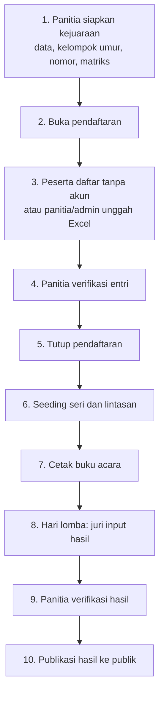

# Cara Pemakaian SeaRIA

Panduan operasional dari persiapan kejuaraan sampai hasil dipublikasikan. Ikuti urutannya: **panitia menyiapkan dulu**, baru peserta mendaftar, lalu hari lomba.

Sistem ini **tanpa pembayaran**. Pendaftaran cukup data atlet dan nomor lomba. Yang login hanya panitia, super admin, dan juri. Peserta mendaftar tanpa akun.

---

## Akun contoh (setelah `php artisan db:seed`)

| Peran | Email | Kata sandi |
| --- | --- | --- |
| Super Admin | `admin@searia.test` | `password` |
| Panitia | `panitia@searia.test` | `password` |
| Juri | `juri@searia.test` | `password` |

Masuk lewat `/login`. Panitia dan Super Admin memakai **sidebar kiri yang sama di semua halaman**. Pilih acara di daftar **Dasbor** atau di pemilih nama acara di sidebar. Juri langsung ke **Tugas juri**.

---

## Alur besar

Status kejuaraan harus maju berurutan. Tidak boleh loncat:

`Draf` → **Pendaftaran terbuka** → **Pendaftaran ditutup** → **Sudah diseeding** → **Hari lomba** → **Selesai** → **Dipublikasikan**

Mundur status hanya Super Admin, dan wajib mengisi alasan.

---

## Bagian A — Panitia menyiapkan kejuaraan

Kerjakan ini **sebelum** peserta bisa mendaftar.

### 1. Master klub dan atlet (opsional tapi berguna)

Menu: **Klub**, **Atlet**.

- Tambah klub yang sudah dikenal. Verifikasi klub yang statusnya masih menunggu.
- Atlet bisa ditambah di sini, atau muncul otomatis saat pendaftaran / import.

Klub yang diketik peserta di form publik masuk berstatus menunggu sampai panitia verifikasi.

### 2. Buat kejuaraan

Menu kiri: **Dasbor** → **Tambah acara**.

Isi nama, tempat, kota, tanggal, jumlah lintasan (6 atau 8), panjang kolam, batas nomor per atlet, jenis Resmi/Fun.

Kejuaraan baru berstatus **Draf**. Di status ini form publik belum terbuka.

### 3. Kelompok umur

Di **Dasbor**, buka acara. Di halaman ringkasan, **Pengaturan acara** → **Kelompok umur**.

- Isi Group 1–6 berdasarkan **tahun lahir** (bukan umur kalender).
- Rentang tidak boleh tumpang tindih.
- Ada isi cepat (quick fill) jika ingin memakai susunan baku.

### 4. Nomor lomba

Di ringkasan acara, **Pengaturan acara** → **Nomor lomba**. Tekan **Isi susunan acara baku** untuk 34 nomor PA/PI sesuai brosur Fun Swimming SeaRIA.

- Tambah nomor acara: nomor urut, gender (Putra/Putri), jarak, gaya, alat.
- Contoh: nomor 13 = 50 m gaya dada putra.

### 5. Matriks kelayakan

Di ringkasan acara, **Pengaturan acara** → **Matriks kelayakan**.

Centang grup mana yang boleh mengikuti nomor mana. Form pendaftaran hanya menampilkan kombinasi yang diizinkan di sini.

### 6. Cek kesiapan, lalu buka pendaftaran

Di ringkasan acara, **Pengaturan acara** → **Kesiapan** menampilkan apa yang masih kurang.

Jika sudah lengkap, di halaman yang sama tekan lanjut status ke **Pendaftaran terbuka**.

Baru setelah ini:

- peserta bisa membuka `/daftar`, **dan**
- panitia/admin bisa mengunggah Excel di **Pendaftaran** → **Import Excel**.

---

## Bagian B — Peserta mendaftar (tanpa akun)

Alamat: **Beranda** atau `/daftar`.

1. Pilih kejuaraan yang statusnya pendaftaran terbuka.
2. Isi kontak pendaftar (nama, telepon, email opsional).
3. Isi data atlet: nama lengkap, L/P, tahun lahir.
4. Ketik **nama klub** dan kabupaten/kota (tidak perlu punya akun klub).
5. Pilih nomor lomba yang muncul (sudah tersaring gender dan kelompok umur).
6. Isi catatan waktu (seed time) jika ada. Dikosongkan berarti NT.
7. Kirim. Sistem memberi kode **`REG-…`**. Simpan kode itu.

Peserta **tidak bisa mengubah** data sendiri setelah kirim. Koreksi lewat panitia.

Format waktu yang diterima: `52.20`, `00:52.20`, `1:34.70`, atau ketikan cepat `5220`.

---

## Bagian C — Panitia atau admin memasukkan peserta

Form publik bukan satu-satunya jalan. **Panitia dan Super Admin** bisa memasukkan pendaftaran peserta sendiri, termasuk lewat **berkas Excel**. Ini jalur yang biasa dipakai jika klub mengirim daftar lewat pesan instan.

Keduanya menghasilkan entri berstatus **menunggu verifikasi**.

### Import Excel (utama)

Siapa: **Panitia** dan **Super Admin**.  
Kapan: kejuaraan berstatus **Pendaftaran terbuka**.  
Di mana: setelah login, buka acara di Dasbor, lalu sidebar **Pendaftaran** → tab **Import Excel**.

Fitur ini hanya ada di bagian pendaftaran, bukan di Dasbor. Tidak ada di halaman publik `/daftar`. Juri juga tidak melihatnya.

Langkah:

1. **Unduh template** Excel. Template sudah menyesuaikan kejuaraan ini (daftar nomor di lembar `NOMOR LOMBA`, petunjuk di lembar `PETUNJUK`).
2. Isi lembar `PESERTA`. Satu baris = satu atlet pada satu nomor lomba. Atlet yang ikut tiga nomor ditulis tiga kali.
3. Kolom wajib: nama lengkap, L/P, tahun lahir, klub/sekolah, kode acara. Catatan waktu boleh kosong (NT).
4. Unggah berkas `.xlsx` atau `.csv` (maksimal 5 MB, 2.000 baris).
5. Sistem menampilkan pratinjau: baris valid, baris bermasalah, dan peringatan (misalnya nama klub mirip).
6. Perbaiki baris bermasalah di layar, atau unduh laporan kesalahan untuk dikembalikan ke klub.
7. Tekan **Import … baris valid**. Data masuk sebagai pendaftaran `pending`.

Setelah itu tetap lewat **verifikasi** (Bagian D) sebelum ikut seeding.

Berkas di atas 200 baris divalidasi di latar belakang; halaman akan menyegarkan diri sampai selesai.

### Input manual (satu per satu)

Di **Pendaftaran** → **Tambah manual** (atlet × nomor lomba). Bisa ubah seed time atau batalkan entri selama pendaftaran masih terbuka. Berguna untuk koreksi kecil, bukan daftar klub utuh.

---

## Bagian D — Verifikasi pendaftaran

Sidebar **Pendaftaran** → **Antrean verifikasi**.

- **Setujui** → status `verified`. Hanya entri ini yang masuk seeding.
- **Tolak** → wajib isi alasan. Pendaftar tidak mengedit sendiri; panitia yang memperbaiki.

Bisa saring per klub, nomor, atau kelompok umur. Penyetujuan massal tersedia.

Setelah semua data rapi, di **Ringkasan** lanjutkan status ke **Pendaftaran ditutup**. Form publik dan import berhenti.

---

## Bagian E — Seeding dan buku acara

### Seeding

Sidebar **Seeding**.

1. Jalankan seeding. Sistem membagi seri dan lintasan dari seed time (NT di belakang).
2. Cek pratinjau per nomor × kelompok umur. Tukar lintasan atau pindah seri jika perlu.
3. **Kunci** seeding jika susunan sudah final.

Lalu di **Ringkasan** lanjutkan status ke **Sudah diseeding**.

### Buku acara

Sidebar **Buku acara**.

- Lihat start list di layar.
- Unduh PDF buku acara.
- Unduh lembar hasil kosong untuk dicatat di pinggir kolam.

Publik juga bisa melihat/unduh start list setelah status `seeded`.

### Penugasan juri

Di ringkasan acara, **Pengaturan acara** → **Penugasan juri**. Tentukan juri mana yang mengisi hasil nomor/seri mana. Tanpa ini, juri tidak melihat tugas. Bisa juga dari halaman **Hasil**.

---

## Bagian F — Hari lomba

1. Di **Ringkasan**, lanjutkan status ke **Hari lomba**.
2. Juri masuk, buka **Tugas juri**, pilih seri, isi waktu per lintasan.
   - Ketikan cepat: `3470` menjadi `00:34.70`.
   - Status khusus: DNS, DNF, DSQ.
   - Setelah seri lengkap, **kunci seri**.
3. Panitia bisa mengisi atau mengkoreksi hasil tanpa menunggu juri (sidebar **Hasil**). Koreksi setelah kunci tercatat di **Audit**.

### Verifikasi hasil

Tab **Verifikasi**. Tandai hasil per seri atau per nomor sudah dicek.

Jika seluruh hasil selesai, lanjutkan status ke **Selesai**.

---

## Bagian G — Publikasi

Di **Ringkasan**, lanjutkan status ke **Dipublikasikan**.

Setelah itu publik bisa:

- Lihat dan unduh PDF hasil di halaman kejuaraan
- Lihat peringkat per nomor × kelompok umur
- Lihat medali / klasemen (jika diaktifkan di halaman hasil)
- Cari atlet di **Cari atlet**
- Lihat kejuaraan lama di **Arsip**

Tab **Export** untuk unduh Excel peserta, start list, hasil, medali.

---

## Siapa mengerjakan apa

| Langkah | Siapa |
| --- | --- |
| Siapkan kejuaraan, grup, nomor, matriks | Panitia |
| Buka / tutup pendaftaran, seeding, publish | Panitia |
| Isi form `/daftar` | Pendaftar (tanpa akun) |
| Import Excel / input manual | Panitia dan Super Admin |
| Verifikasi entri | Panitia |
| Input waktu di hari lomba | Juri (tugasnya) atau panitia |
| Mundurkan status kejuaraan | Super Admin |

---

## Yang sering terlewat

- Form publik **tidak muncul** selama kejuaraan masih Draf. Buka status dulu.
- Peserta yang belum **disetujui** tidak masuk seeding.
- Seeding dihitung **per nomor lomba × kelompok umur**, bukan per nomor saja.
- Seed time (catatan waktu pendaftaran) **bukan** hasil lomba. Hasil diisi juri di hari lomba.
- Satu atlet satu kali per nomor. Atlet yang ikut tiga nomor = tiga baris (form, Excel, maupun manual).
- Setelah dikirim, pendaftar tidak mengedit lagi; koreksi di sisi panitia.
- Panitia/admin **boleh** mengunggah Excel selama status masih Pendaftaran terbuka; setelah ditutup, import berhenti.
