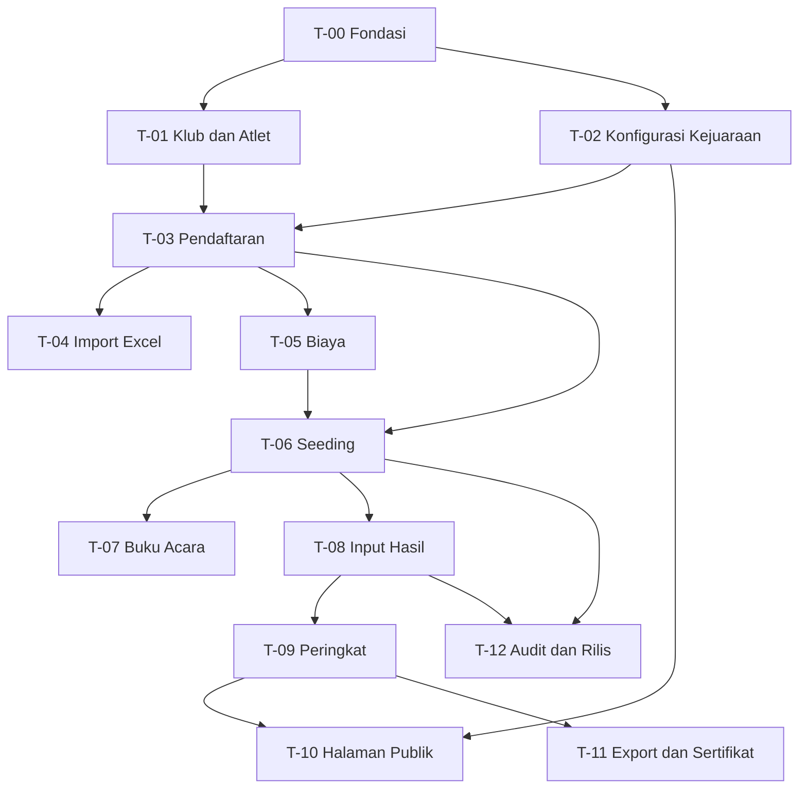

# Backlog Task per Fitur

Folder ini memecah spesifikasi di [../README.md](../README.md) menjadi task yang bisa langsung dikerjakan. Satu berkas mewakili satu modul, dan satu task di dalamnya berukuran kira-kira setengah hingga dua hari kerja.

## Daftar Modul

| Modul | Berkas | Isi | Gelombang |
| --- | --- | --- | --- |
| T-00 | [Fondasi dan Autentikasi](T-00-fondasi.md) | Setup proyek, peran, layout, otorisasi | 1 |
| T-01 | [Master Klub dan Atlet](T-01-master-klub-atlet.md) | Data klub, sekolah, dan atlet | 1 |
| T-02 | [Konfigurasi Kejuaraan](T-02-konfigurasi-kejuaraan.md) | Kejuaraan, kelompok umur, nomor lomba, matriks kelayakan | 1 |
| T-03 | [Pendaftaran](T-03-pendaftaran.md) | Form pendaftaran, validasi, verifikasi panitia | 1 |
| T-04 | [Import Excel](T-04-import-excel.md) | Template, validasi baris, pratinjau, commit | 1 |
| T-05 | [Biaya dan Pembayaran](T-05-biaya-pembayaran.md) | Tagihan per klub, bukti transfer, verifikasi | 2 |
| T-06 | [Seeding Seri dan Lintasan](T-06-seeding.md) | Algoritma pembagian seri dan penempatan lintasan | 1 |
| T-07 | [Buku Acara dan Cetak](T-07-buku-acara.md) | Start list layar dan PDF, lembar hasil kosong | 1 |
| T-08 | [Input Hasil Juri](T-08-input-hasil.md) | Layar per seri, parser waktu cepat, penguncian | 1 |
| T-09 | [Peringkat dan Publikasi](T-09-peringkat-publikasi.md) | Perhitungan peringkat, medali, klasemen klub | 1 |
| T-10 | [Halaman Publik](T-10-halaman-publik.md) | Beranda, jadwal, biaya, arsip kejuaraan | 2 |
| T-11 | [Export dan Sertifikat](T-11-export-sertifikat.md) | Export Excel, sertifikat peserta dan juara | 2 |
| T-12 | [Audit, Keamanan, dan Rilis](T-12-audit-keamanan-rilis.md) | Jejak audit, pengetatan keamanan, persiapan produksi | 3 |

## Ketergantungan Antar Modul



Jalur kritis menuju kejuaraan pertama yang bisa dijalankan: T-00, T-02, T-01, T-03, T-06, T-07, T-08, T-09. Modul T-04 dapat dikerjakan paralel dengan T-06 karena keduanya hanya bergantung pada T-03.

## Milestone

| Milestone | Berisi | Hasil yang bisa didemokan |
| --- | --- | --- |
| M1 Fondasi | T-00, T-01, T-02 | Panitia bisa membuat kejuaraan lengkap dengan kelompok umur dan nomor lomba |
| M2 Pendaftaran | T-03, T-04 | Pelatih bisa mendaftarkan atlet, panitia bisa import dari Excel |
| M3 Susunan Lomba | T-06, T-07 | Seeding berjalan dan buku acara siap cetak |
| M4 Hari Lomba | T-08, T-09 | Juri mengisi hasil, peringkat dan medali muncul |
| M5 Publikasi | T-05, T-10, T-11 | Halaman publik, tagihan, sertifikat |
| M6 Pengetatan | T-12 | Audit lengkap, siap dipakai produksi |

## Format Task

Setiap task memakai bentuk yang sama supaya bisa disalin ke Jira, Trello, atau GitHub Issues tanpa penyuntingan berarti.

```
### T-0X-0Y Judul task

Prasyarat  : task yang harus selesai lebih dulu
Acuan      : dokumen spesifikasi yang relevan
Perkiraan  : S (setengah hari) / M (satu hari) / L (dua hari)

Deskripsi singkat mengenai apa yang dibangun dan mengapa.

Berkas yang disentuh:
- daftar path

Kriteria selesai:
- [ ] pernyataan yang bisa diperiksa benar atau salah

Uji:
- daftar test yang harus lulus
```

Kriteria selesai selalu ditulis sebagai pernyataan yang dapat dinilai benar atau salah oleh orang lain, bukan sebagai deskripsi pekerjaan. "Form menolak tahun lahir di luar rentang kelompok umur" dapat diperiksa, sedangkan "membuat validasi tahun lahir" tidak.

## Konvensi Teknis

Berlaku untuk seluruh task supaya tidak diulang di setiap berkas.

| Aspek | Ketentuan |
| --- | --- |
| Struktur kode | Controller tipis, logika domain di kelas `App\Services` atau `App\Actions` |
| Validasi | Form Request terpisah, bukan validasi inline di controller |
| Otorisasi | Policy per model, dipanggil lewat `authorize()` |
| Kueri | Query builder atau Eloquent scope, hindari kueri mentah kecuali disebut eksplisit di task |
| Migrasi | Satu berkas per tabel, mengikuti urutan pada [../08-database.md](../08-database.md) |
| Test | Pest. Feature test untuk alur, unit test untuk logika hitung |
| Penamaan | Nama tabel dan kolom dalam bahasa Inggris, teks antarmuka dalam bahasa Indonesia |
| Commit | Diawali kode task, contoh `T-06-02: hitung pembagian seri` |

## Ringkasan Jumlah Task

| Modul | Jumlah task | Perkiraan total |
| --- | --- | --- |
| T-00 | 8 | 7 hari |
| T-01 | 6 | 5 hari |
| T-02 | 7 | 7 hari |
| T-03 | 8 | 8 hari |
| T-04 | 8 | 9 hari |
| T-05 | 6 | 5 hari |
| T-06 | 8 | 8 hari |
| T-07 | 6 | 6 hari |
| T-08 | 8 | 8 hari |
| T-09 | 7 | 6 hari |
| T-10 | 7 | 6 hari |
| T-11 | 6 | 5 hari |
| T-12 | 8 | 7 hari |
| **Total** | **93** | **87 hari** |

Angka perkiraan mengasumsikan satu pengembang yang sudah terbiasa dengan Laravel. Dikerjakan berdua dengan pembagian modul yang memperhatikan graf ketergantungan di atas, milestone M1 sampai M4 dapat dicapai dalam sekitar delapan minggu.
