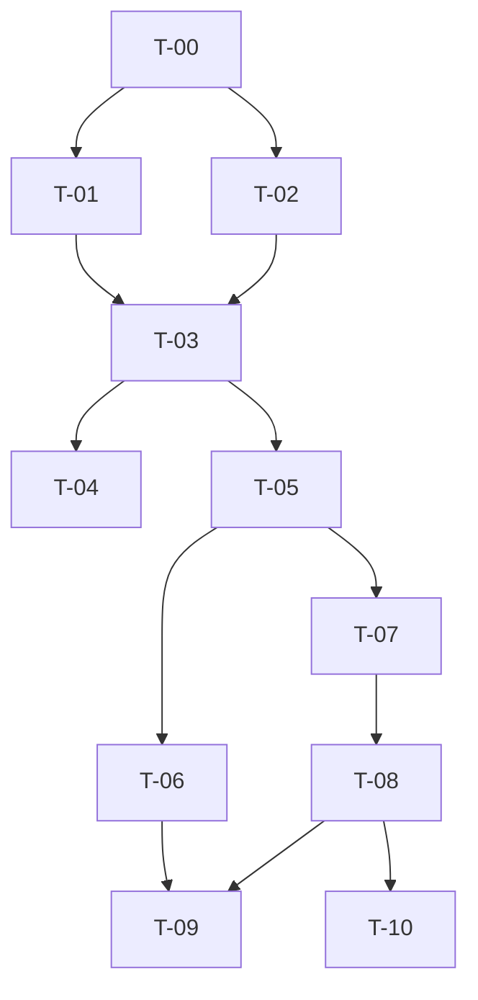

# Backlog Task MVP

Spesifikasi di [../README.md](../README.md) dipecah menjadi modul yang bisa dikerjakan. Fitur ditunda ada di [../deferred/](../deferred/README.md).

## Daftar Modul

| Modul | Berkas | Isi | Milestone |
| --- | --- | --- | --- |
| T-00 | [Fondasi](T-00-fondasi.md) | Auth, peran, layout, SwimTime | M1 |
| T-01 | [Klub & Atlet](T-01-master-klub-atlet.md) | Master data | M1 |
| T-02 | [Kejuaraan](T-02-konfigurasi-kejuaraan.md) | Grup, nomor, matriks | M1 |
| T-03 | [Pendaftaran publik](T-03-pendaftaran.md) | Form tanpa akun, tanpa tagihan | M2 |
| T-04 | [Input panitia](T-04-input-panitia.md) | Manual + Excel | M2 |
| T-05 | [Seeding](T-05-seeding.md) | Seri & lintasan | M3 |
| T-06 | [Buku acara & hasil PDF](T-06-buku-acara-hasil.md) | Start list + PDF hasil | M3–M4 |
| T-07 | [Input hasil](T-07-input-hasil.md) | Juri & panitia | M4 |
| T-08 | [Peringkat & publish](T-08-peringkat-publikasi.md) | Ranking lintas seri | M4 |
| T-09 | [Publik minimal](T-09-halaman-publik.md) | Beranda, unduh acara/hasil | M4 |
| T-10 | [Rilis ringan](T-10-rilis.md) | Hardening dasar, backup opsional | M4 |

## Ketergantungan

## Milestone

| Milestone | Modul | Demo |
| --- | --- | --- |
| M1 | T-00 … T-02 | Kejuaraan + grup + nomor |
| M2 | T-03, T-04 | Form + Excel + manual + verifikasi |
| M3 | T-05, T-06 (acara) | Seeding + PDF buku acara |
| M4 | T-07 … T-10 | Input hasil + PDF hasil + publish |

## Konvensi

| Aspek | Ketentuan |
| --- | --- |
| Struktur | Controller tipis; logika di `Actions` / `Services` |
| Validasi | Form Request |
| Otorisasi | Policy |
| Test | Pest |
| UI | Bahasa Indonesia; PDF boleh label mirip cetakan resmi |
| Commit | Prefiks kode task, contoh `T-06-02: pdf hasil lomba` |
